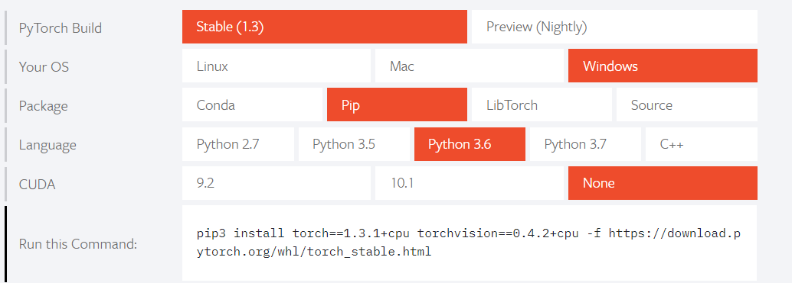

# Pytorch简易教程

## 简介

-  PyTorch的前身便是Torch，其底层和Torch框架一样，但是使用Python重新写了很多内容，不仅更加灵活，支持动态图，而且提供了Python接口。它是由Torch7团队开发，是一个以Python优先的深度学习框架，不仅能够实现强大的GPU加速，同时还支持动态神经网络，这是很多主流深度学习框架比如Tensorflow等都不支持的。 

## 安装

- 安装指令可在官网进行查看，可根据自己的操作系统，应用场景等生成对应安装指令。< https://pytorch.org/ >

