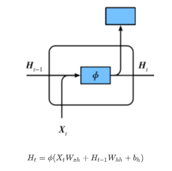
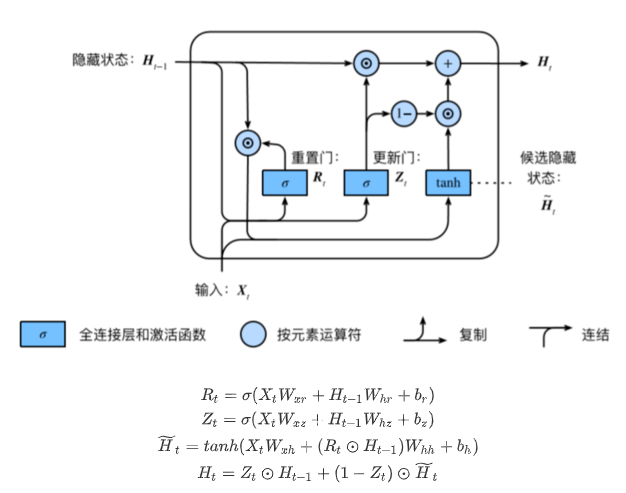
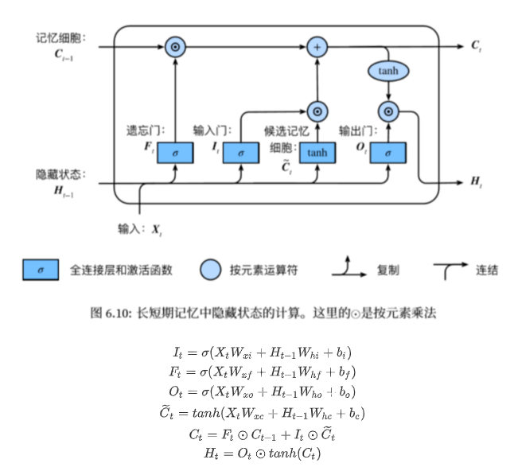

## 任务名称 

过拟合、欠拟合及其解决方案；梯度消失、梯度爆炸；循环神经网络进阶

## 学习心得

1. 欠拟合现象：模型无法达到一个较低的误差；过拟合现象：训练误差较低但是泛化误差依然较高，二者相差较大。发生欠拟合的时候在训练集上训练误差不能达到一个比较低的水平，所以过拟合和欠拟合不可能同时发生。

2. L2范数正则化也就是权重衰减是用来应对过拟合的。

3. 深度模型有关数值稳定性的典型问题是消失（vanishing）和爆炸（explosion）。

4. 环境因素造成的模型预测问题：

   - **协变量偏差**：测试时输入数据分布与训练时不一致，发生变化。例如：区分猫和狗的一个例子。我们的训练数据使用的是**猫和狗的真实**的照片，但是在测试时，我们被要求对**猫和狗的卡通图片**进行分类。统计学家称这种协变量变化是因为问题的根源在于特征分布的变化（即协变量的变化）。数学上，我们可以说P（x）改变了，但P（y∣x）保持不变。尽管它的有用性并不局限于此，当我们认为x导致y时，协变量移位通常是正确的假设。
   - **标签偏移**：测试数据中出现训练数据未见过的标签。当我们认为导致偏移的是标签P（y）上的边缘分布的变化，但类条件分布是不变的P（x∣y）时，就会出现相反的问题。当我们认为y导致x时，标签偏移是一个合理的假设。有时标签偏移和协变量移位假设可以同时成立。例如：训练数据集，数据很少只包含流感p(y)的样本。而测试数据集有流感p(y)和流感q(y)，其中不变的是流感症状p(x|y)。
   - **概念偏移**：标签定义发生变化。例如：猫的定义可能不会改变，但我们能不能对软饮料也这么说呢？事实证明，如果我们周游美国，按地理位置转移数据来源，我们会发现，即使是如图所示的这个简单术语的定义也会发生相当大的概念转变。如果我们要建立一个机器翻译系统，分布P（y∣x）可能因我们的位置而异。这个问题很难发现。另一个可取之处是P（y∣x）通常只是逐渐变化。

5. RNN：RNN存在的问题：梯度较容易出现衰减或爆炸（BPTT）。

   

6. GRU：⻔控循环神经⽹络：捕捉时间序列中时间步距离较⼤的依赖关系。
      - 重置⻔有助于捕捉时间序列⾥短期的依赖关系；
      - 更新⻔有助于捕捉时间序列⾥⻓期的依赖关系。

   

7. LSTM：**长短期记忆long short-term memory**

      - 遗忘门:控制上一时间步的记忆细胞
      - 输入门:控制当前时间步的输入
      - 输出门:控制从记忆细胞到隐藏状态
      - 记忆细胞：⼀种特殊的隐藏状态的信息的流动

      

