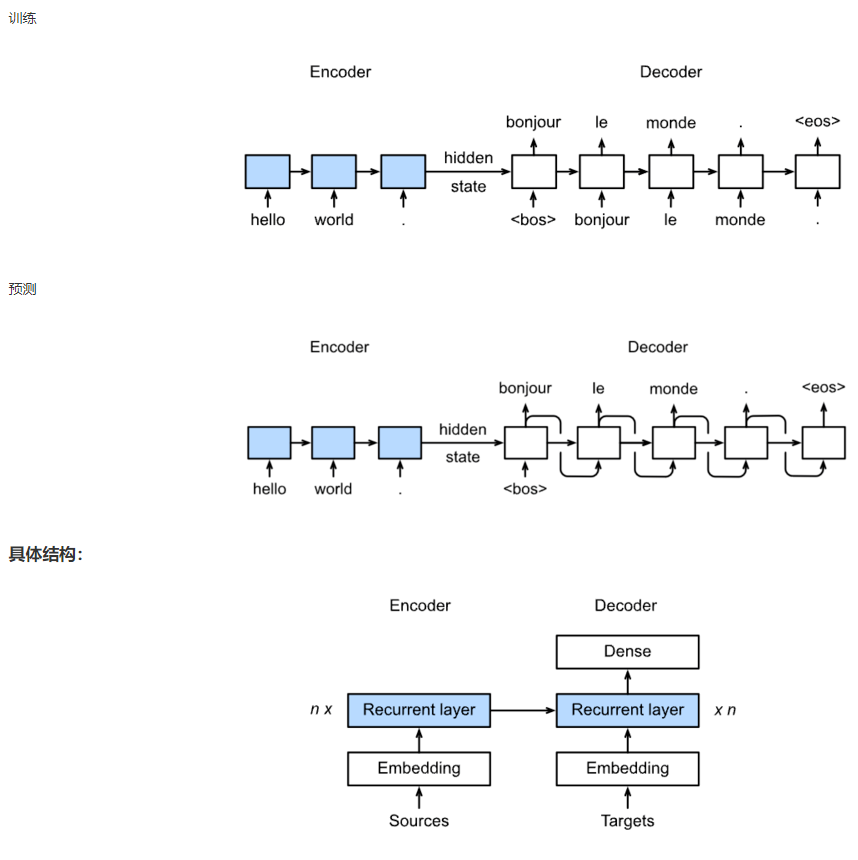
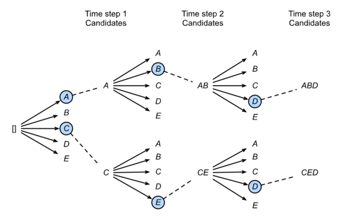
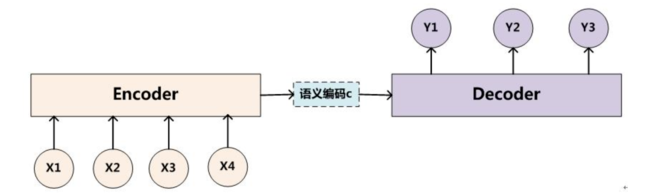
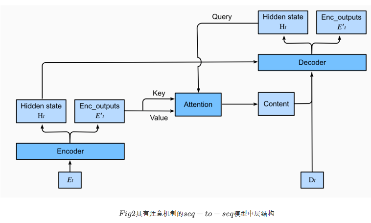
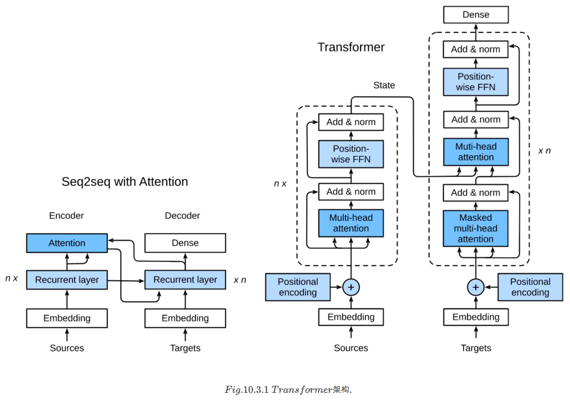
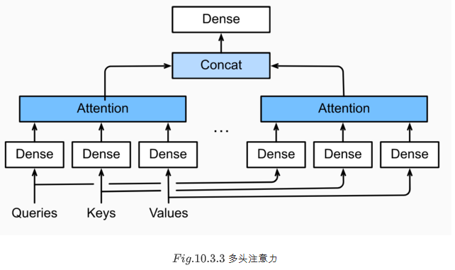

## 任务名称 

机器翻译及相关技术；注意力机制与Seq2seq模型；Transformer

## 学习心得

1. 机器翻译：Sequence to Sequence模型。训练的时候序列对序列，预测的时候将时刻t的输出作为下一个时刻的输入。

2. SequenceMask：将之前padding的部分替换为0，便于计算损失。
3. NLP任务中，词向量层也就是embedding层通常作为网络的第一层，用于将字词转换为向量，方便模型进行计算。
4. **集束搜素**：集束搜索(Beam Search)是维特比算法的贪心形式。结合了二者的优点。得到的是全局最优解。每一次迭代候选集个数由参数控制。不采用维特比算法的原因：搜索空间过大，效率低下。

5. Encoder-Decoder常应用于输入序列和输出序列的长度是可变的，如机器翻译、对话机器人、语音识别，而分类问题的输出是固定的类别，不需要使用Encoder-Decoder。
   - encoder：输入到隐藏状态
   - decoder：隐藏状态到输出

6. 注意力机制，在Dot-product Attention中，key与query维度需要一致，在MLP Attention中则不需要。点积注意力层不引入新的模型参数。有效长度不同导致 Attention Mask 不同，屏蔽掉无效位置后进行attention，会导致不同的输出。参考代码Dot-Product Attention的测试部分。
7. 加入Attention机制的seq2seq模型，注意力机制本身有高效的并行性，但引入注意力并不能改变seq2seq内部RNN的迭代机制，因此无法加速。seq2seq模型的预测需人为设定终止条件，设定最长序列长度或者输出[EOS]结束符号，若不加以限制则可能生成无穷长度序列。

8. Transformer中，训练过程进行1次前向传播，预测过程要进行句子长度次前向传播。Decoder 部分的第二个注意力层不是自注意力，key-value来自编码器而query来自解码器。自注意力模块理论上可以捕捉任意距离的依赖关系。

   - Transformer blocks：将seq2seq模型重的循环网络替换为了Transformer Blocks，该模块包含一个多头注意力层（Multi-head Attention Layers）以及两个position-wise feed-forward networks（FFN）。对于解码器来说，另一个多头注意力层被用于接受编码器的隐藏状态。
   - Add and norm：多头注意力层和前馈网络的输出被送到两个“add and norm”层进行处理，该层包含残差结构以及层归一化。
   - Position encoding：由于自注意力层并没有区分元素的顺序，所以一个位置编码层被用于向序列元素里添加位置信息。

   

9. 在Transformer模型中，注意力头数为h，嵌入向量和隐藏状态维度均为d，那么一个多头注意力层所含的参数量是：*h*个注意力头中，每个的参数量为$3d^2$，最后的输出层形状为$hd \times d$，所以参数量共为$4hd^2$。

10. 多头注意力：

11. 批归一化（Batch Normalization）才是对每个神经元的输入数据以mini-batch为单位进行汇总。Batch Norm是对于batch size这个维度进行计算均值和方差的，而Layer Norm则是对最后一维进行计算。层归一化可以防止层内的数值变化过大，从而有利于加快训练速度并且提高泛化性能。