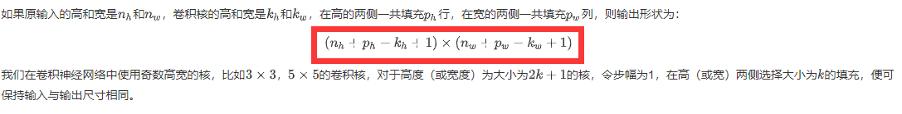

## 任务名称 

卷积神经网络基础；leNet；卷积神经网络进阶

## 学习心得

1. 假如你用全连接层处理一张$256 \times 256$的彩色（RGB）图像，输出包含1000个神经元，在使用偏置的情况下，参数数量是：图像展平后长度为$3 \times 256 \times 256$，权重参数和偏置参数的数量是$3 \times 256 \times 256 \times 1000 + 1000 = 196609000$。
2. 假如你用全连接层处理一张$256 \times 256$的彩色（RGB）图像，卷积核的高宽是$3 \times 3$，输出包含10个通道，在使用偏置的情况下，这个卷积层共有多少个参数：输入通道数是3，输出通道数是10，所以参数数量是$10 \times 3 \times 3 \times 3 + 10 = 280$。
3. 关于池化层，池化层有参与模型的正向计算，同样也会参与反向传播，池化层直接对窗口内的元素求最大值或平均值，并没有模型参数参与计算，池化层的输入和输出具有相同的通道数。
4. 二维互相关（cross-correlation）运算的输入是一个二维输入数组和一个二维核（kernel）数组，输出也是一个二维数组，其中核数组通常称为卷积核或过滤器（filter）。卷积核的尺寸通常小于输入数组，卷积核在输入数组上滑动，在每个位置上，卷积核与该位置处的输入子数组按元素相乘并求和，得到输出数组中相应位置的元素。图1展示了一个互相关运算的例子，阴影部分分别是输入的第一个计算区域、核数组以及对应的输出。

5. 特征图与感受野：二维卷积层输出的二维数组可以看作是输入在空间维度（宽和高）上某一级的表征，也叫特征图（feature map）。影响元素x的前向计算的所有可能输入区域（可能大于输入的实际尺寸）叫做x的感受野（receptive field）。
6. 填充（padding）：是指在输入高和宽的两侧填充元素（通常是0元素），图2里我们在原输入高和宽的两侧分别添加了值为0的元素。

7. 步幅：在互相关运算中，卷积核在输入数组上滑动，每次滑动的行数与列数即是步幅（stride）。此前我们使用的步幅都是1，图3展示了在高上步幅为3、在宽上步幅为2的二维互相关运算。

8. 多输入通道：卷积层的输入可以包含多个通道，图4展示了一个含2个输入通道的二维互相关计算的例子。

9. 1×1卷积层，形状为1×1的卷积核，我们通常称这样的卷积运算为1×1卷积，称包含这种卷积核的卷积层为1×1卷积层。图5展示了使用输入通道数为3、输出通道数为2的1×1卷积核的互相关计算。

	-  放缩通道数：通过控制卷积核的数量达到通道数的放缩。
	-  增加非线性。1×1卷积核的卷积过程相当于全连接层的计算过程，并且还加入了非线性激活函数，从而可以增	加网络的非线性。
	- 计算参数少

10. 全连接层与卷积层：使用全连接层的局限性：

   - 图像在同一列邻近的像素在这个向量中可能相距较远。它们构成的模式可能难以被模型识别。
   - 对于大尺寸的输入图像，使用全连接层容易导致模型过大。

   使用卷积层的优势：

   - 卷积层保留输入形状。
   - 卷积层通过滑动窗口将同一卷积核与不同位置的输入重复计算，从而避免参数尺寸过大。

11. AlexNet首次证明了学习到的特征可以超越⼿⼯设计的特征，从而⼀举打破计算机视觉研究的前状。

12. VGG：通过重复使⽤简单的基础块来构建深度模型。

13. LeNet、AlexNet和VGG：先以由卷积层构成的模块充分抽取 空间特征，再以由全连接层构成的模块来输出分类结果。NiN：串联多个由卷积层和“全连接”层构成的小⽹络来构建⼀个深层⽹络。⽤了输出通道数等于标签类别数的NiN块，然后使⽤全局平均池化层对每个通道中所有元素求平均并直接⽤于分类。

