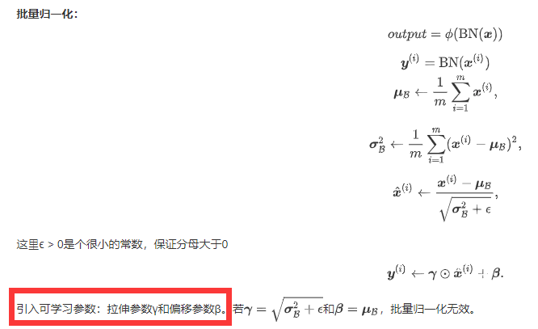
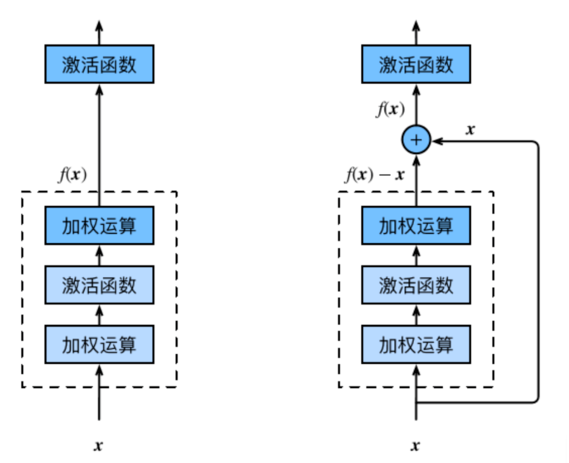
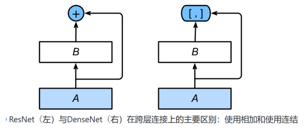
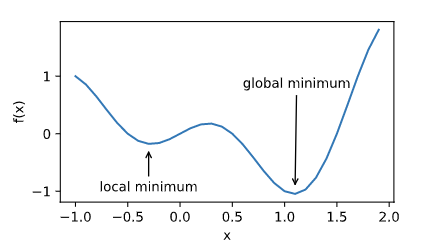
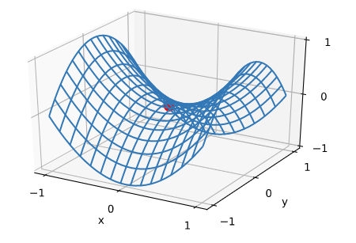
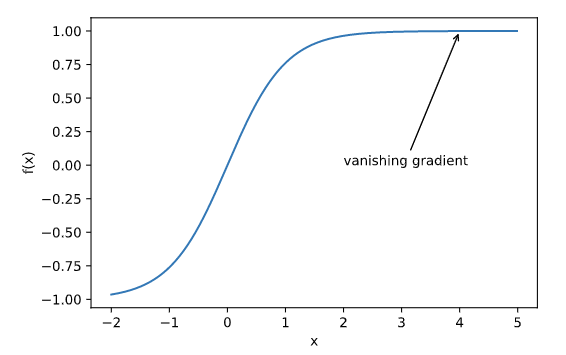
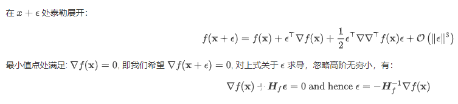

## 任务名称 

批量归一化和残差网络；凸优化；梯度下降

## 学习心得

1. 批量归一化（深度模型）：利用小批量上的均值和标准差，不断调整神经网络中间输出，从而使整个神经网络在各层的中间输出的数值更稳定。

   - 对全连接层做批量归一化：位置——全连接层中的仿射变换和激活函数之间。

   

   - 对卷积层做批量归一化：位置——卷积计算之后、应⽤激活函数之前。如果卷积计算输出多个通道，我们需要对这些通道的输出分别做批量归一化，且每个通道都拥有独立的拉伸和偏移参数。 
   - 预测时的批量归一化：用移动平均估算整个训练数据集的样本均值和方差。

2. `nn.BatchNorm2d(6)`为卷积层的批量归一化，参数为通道数。`nn.BatchNorm1d()`表示全连接层的BN，参数为输出神经元个数。

3. 深度学习的问题：深度CNN网络达到一定深度后再一味地增加层数并不能带来进一步地分类性能提高，反而会招致网络收敛变得更慢，准确率也变得更差。

4. 残差块（Residual Block）：在残差块中，输⼊可通过跨层的数据线路更快 地向前传播。易于捕捉恒等映射的细微波动。

   

5. 稠密连接网络（DenseNet）：

   - 稠密块（dense block）： 定义了输入和输出是如何连结的。**输出通道数=输入通道数+卷积层个数*卷积输出通道数。**
   - 过渡层（transition layer）：用来控制通道数，使之不过大。
   - 过渡层中：1×1卷积层——来减小通道数。步幅为2的平均池化层——减半高和宽。

6. 尽管优化方法可以最小化深度学习中的损失函数值，但本质上优化方法达到的目标与深度学习的目标并不相同。

   - 优化方法目标：训练集损失函数值。
   - 深度学习目标：测试集损失函数值（泛化性）。

7. 优化在深度学习中的挑战

   - 局部最小值：

   

   - 鞍点：

   

   - 梯度消失：

   

   8. 牛顿法：属于自适应方法。

   

   9. 梯度下降更新一次的时间复杂度为 O(n)，随机梯度下降为O(1)。
   10. 梯度下降、随机梯度下降和小批量随机梯度下降的区别在于每次更新时用的样本量。