## 任务名称 

优化算法进阶；word2vec；词嵌入进阶

## 学习心得

1. Solution to ill-condition：
   - **Preconditioning gradient vector**: applied in Adam, RMSProp, AdaGrad, Adelta, KFC, Natural gradient and other secord-order optimization algorithms.
   - **Averaging history gradient**: like momentum, which allows larger learning rates to accelerate convergence; applied in Adam, RMSProp, SGD momentum.
2. 动量法(momentum)：

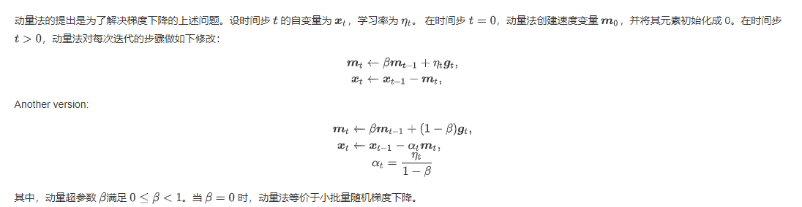

3. AdaGrad算法，它根据自变量在每个维度的梯度值的大小来调整各个维度上的学习率，从而避免统一的学习率难以适应所有维度的问题。当学习率在迭代早期降得较快且当前解依然不佳时，AdaGrad算法在迭代后期由于学习率过小，可能较难找到一个有用的解。

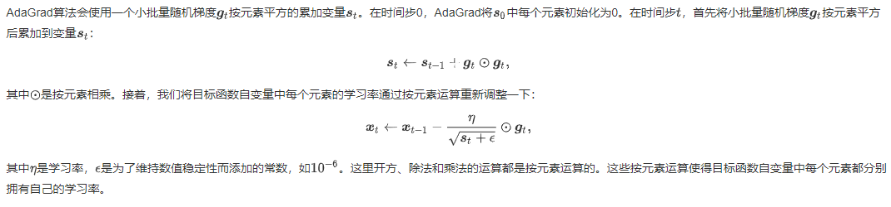

4. RMSProp算法对AdaGrad算法做了修改。该算法源自Coursera上的一门课程，即“机器学习的神经网络”。AdaGrad算法在迭代后期由于学习率过小，可能较难找到一个有用的解。RMSProp为了解决这一问题。

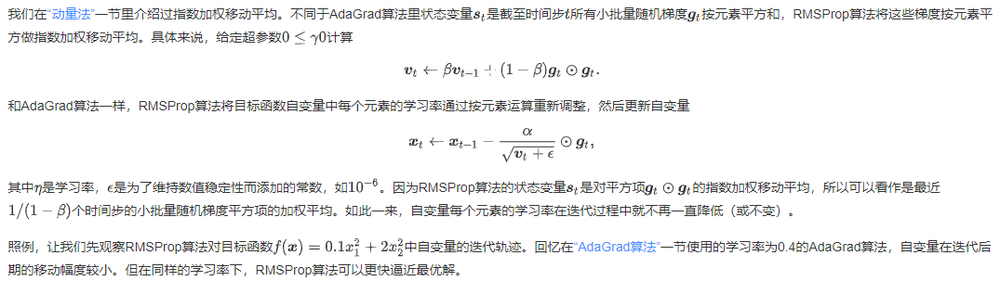

5. AdaDelta算法也针对AdaGrad算法在迭代后期可能较难找到有用解的问题做了改进。有意思的是，AdaDelta算法**没有学习率这一超参数**。Adelta是基于RMSprop的改进，只需传入EMA的衰减参数。

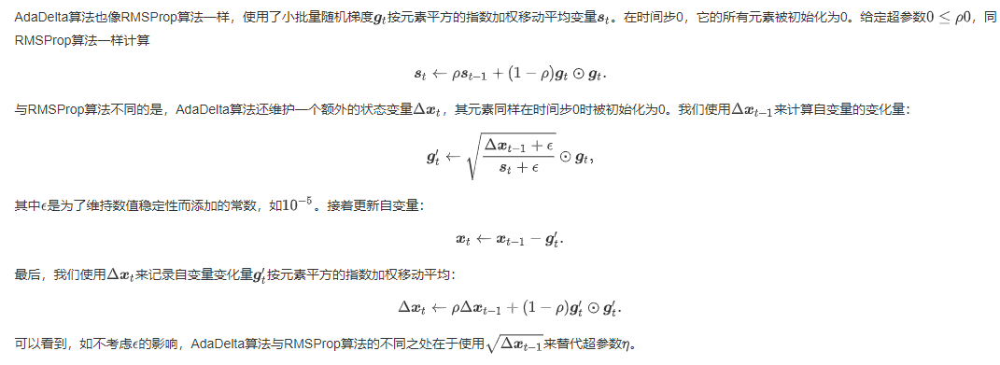

6. Adam算法在RMSProp算法基础上对小批量随机梯度也做了指数加权移动平均。Adam使用了两次Exponential Moving Average。是RMSProp和Momentum算法的结合，并对EMA权重进行了无偏操作。

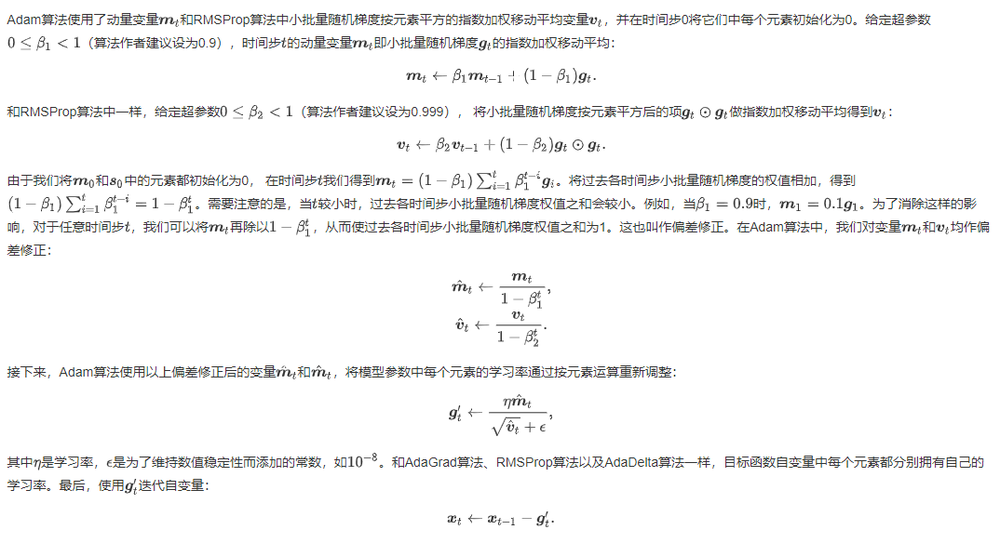

7. 两种word2vec模型：

   - skip-gram：

   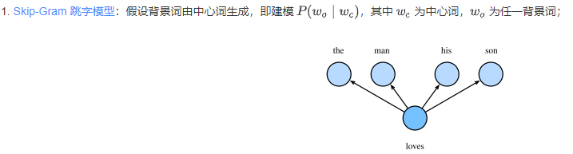

   - CBOW：

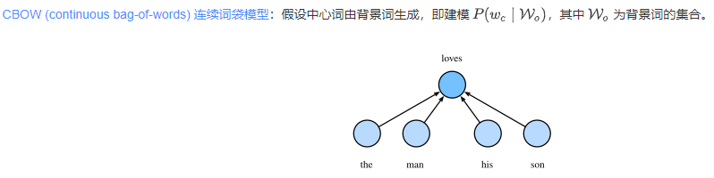

8. 二次采样：文本数据中一般会出现一些高频词，如英文中的“the”“a”和“in”。通常来说，在一个背景窗口中，一个词（如“chip”）和较低频词（如“microprocessor”）同时出现比和较高频词（如“the”）同时出现对训练词嵌入模型更有益。因此，训练词嵌入模型时可以对词进行二次采样。 具体来说，数据集中每个被索引词 wi 将有一定概率被丢弃，该丢弃概率为：

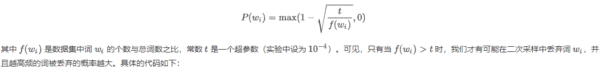

9. skip-gram跳字模型：

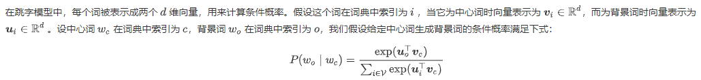

10. 负采样：由于 softmax 运算考虑了背景词可能是词典 V 中的任一词，对于含几十万或上百万词的较大词典，就可能导致计算的开销过大。我们将以 skip-gram 模型为例，介绍负采样 (negative sampling) 的实现来尝试解决这个问题。*除负采样方法外，还有层序 softmax (hiererarchical softmax) 方法也可以用来解决计算量过大的问题*

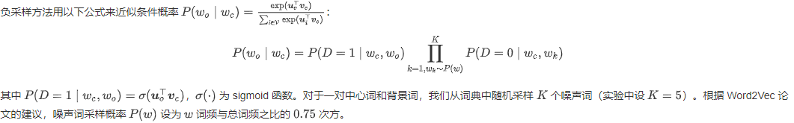

11. `nn.Embedding` 层的实际作用就是将整数张量中的下标，替换为词向量，从张量形状上看，就是在最后添加 `embed_dim` 维，代码中 `num_embedding` 为词典的大小。

12. **子词嵌入（subword embedding）**：[FastText](https://zh.d2l.ai/chapter_natural-language-processing/fasttext.html) 以固定大小的 n-gram 形式将单词更细致地表示为了子词的集合，而 [BPE (byte pair encoding)](https://d2l.ai/chapter_natural-language-processing/subword-embedding.html#byte-pair-encoding) 算法则能根据语料库的统计信息，自动且动态地生成高频子词的集合；
13. [GloVe 全局向量的词嵌入](https://zh.d2l.ai/chapter_natural-language-processing/glove.html): 通过等价转换 Word2Vec 模型的条件概率公式，我们可以得到一个全局的损失函数表达，并在此基础上进一步优化模型。
14. glove模型：

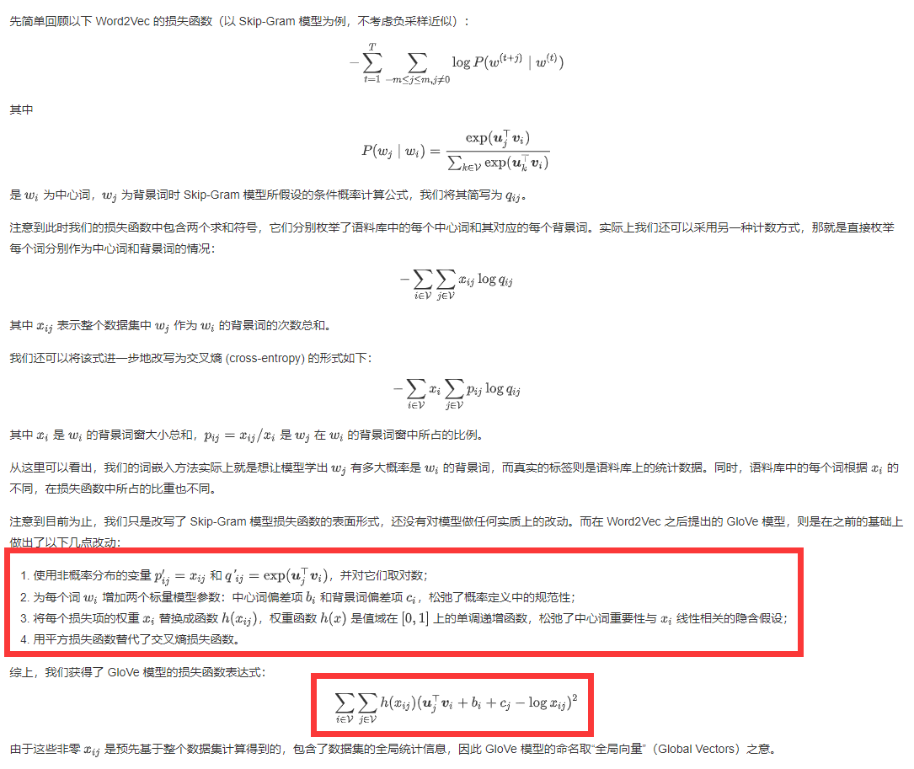
15. 由于他人训练词向量时用到的语料库和当前任务上的语料库通常都不相同，所以词典中包含的词语以及词语的顺序都可能有很大差别，此时应当根据当前数据集上词典的顺序，来依次读入词向量，同时，为了避免训练好的词向量在训练的最初被破坏，还可以适当调整嵌入层的学习速率甚至设定其不参与梯度下降.