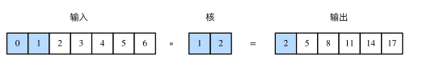
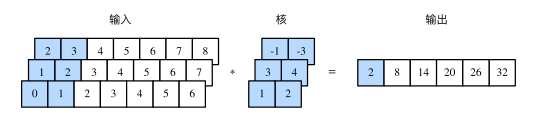
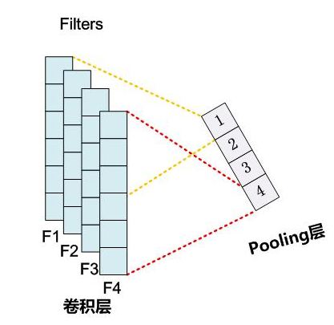
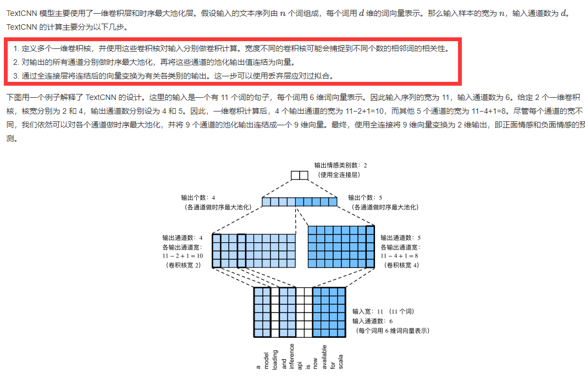
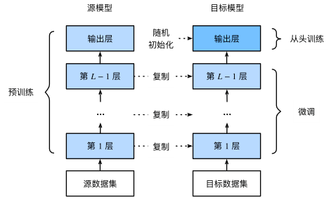

## 任务名称 

文本分类；数据增强；模型微调

- 微调目前是比较火热的技术，尤其是NLP中BERT造成的影响极其深远。

## 学习心得

1. 一维卷积：与二维卷积层一样，一维卷积层使用一维的互相关运算。在一维互相关运算中，卷积窗口从输入数组的最左方开始，按从左往右的顺序，依次在输入数组上滑动。当卷积窗口滑动到某一位置时，窗口中的输入子数组与核数组按元素相乘并求和，得到输出数组中相应位置的元素。如图所示，输入是一个宽为 7 的一维数组，核数组的宽为 2。可以看到输出的宽度为 7−2+1=6，且第一个元素是由输入的最左边的宽为 2 的子数组与核数组按元素相乘后再相加得到的：0×1+1×2=2。

2. 多输入通道的一维互相关运算也与多输入通道的二维互相关运算类似：在每个通道上，将核与相应的输入做一维互相关运算，并将通道之间的结果相加得到输出结果。下图展示了含 3 个输入通道的一维互相关运算，其中阴影部分为第一个输出元素及其计算所使用的输入和核数组元素：0×1+1×2+1×3+2×4+2×(−1)+3×(−3)=2。

3. 时序最大池化：一维池化层。TextCNN 中使用的时序最大池化（max-over-time pooling）层实际上对应一维全局最大池化层：假设输入包含多个通道，各通道由不同时间步上的数值组成，各通道的输出即该通道所有时间步中最大的数值。因此，时序最大池化层的输入在各个通道上的时间步数可以不同。参考资料：<https://blog.csdn.net/malefactor/article/details/51078135>

4. 为提升计算性能，我们常常将不同长度的时序样本组成一个小批量，并通过在较短序列后附加特殊字符（如0）令批量中各时序样本长度相同。这些人为添加的特殊字符当然是无意义的。由于时序最大池化的主要目的是抓取时序中最重要的特征，它通常能使模型不受人为添加字符的影响。

5. textCNN:

   

6. 针对任务或语言的特性特殊实现的分词函数，将更有利于模型的训练，但在设计该函数时要注意预训练词向量是定义在什么词典上的，**不能使 out-of-vocabulary 词过多**.

7. PyTorch 的嵌入层在进行前向传播时，其输入张量需要为 `torch.long` 格式.

8. 由于自然语言中常常有一些特殊的倒装结构，所以拥有两个方向的隐藏状态的双向循环神经网络，其输出更具文本代表性。注意，虽然两个方向的隐藏状态在输出前被拼接在了一起，但他们仍然是独立地被运算出来的，所以双向循环神经网络也不能从根本上解决文本的双向依赖问题，而卷积神经网络和 Transformer 这样完全并行的结构则不存在该问题.

9. 图像增广（image augmentation）技术通过对训练图像做一系列随机改变，来产生相似但又不同的训练样本，从而扩大训练数据集的规模。图像增广的另一种解释是，随机改变训练样本可以降低模型对某些属性的依赖，从而提高模型的泛化能力。例如，我们可以对图像进行不同方式的裁剪，使感兴趣的物体出现在不同位置，从而减轻模型对物体出现位置的依赖性。我们也可以调整亮度、色彩等因素来降低模型对色彩的敏感度。可以说，在当年AlexNet的成功中，图像增广技术功不可没。

10. 左右翻转图像通常不改变物体的类别。它是最早也是最广泛使用的一种图像增广方法。torchvision.transforms模块创建RandomHorizontalFlip来实现一半概率的图像水平（左右）翻转。上下翻转不如左右翻转通用。但是至少对于样例图像，上下翻转不会造成识别障碍。RandomVerticalFlip来实现一半概率的图像垂直（上下）翻转。

11. 另一类增广方法是变化颜色。我们可以从4个方面改变图像的颜色：亮度（brightness）、对比度（contrast）、饱和度（saturation）和色调（hue）。

12. 迁移学习（transfer learning），将从源数据集学到的知识迁移到目标数据集上。例如，虽然ImageNet数据集的图像大多跟椅子无关，但在该数据集上训练的模型可以抽取较通用的图像特征，从而能够帮助识别边缘、纹理、形状和物体组成等。这些类似的特征对于识别椅子也可能同样有效。

13. 迁移学习中的一种常用技术：微调（fine tuning）。微调由以下4步构成。**当目标数据集远小于源数据集时，微调有助于提升模型的泛化能力。**

    1.  在源数据集（如ImageNet数据集）上预训练一个神经网络模型，即源模型。
    2.  创建一个新的神经网络模型，即目标模型。它复制了源模型上除了输出层外的所有模型设计及其参数。我们假设这些模型参数包含了源数据集上学习到的知识，且这些知识同样适用于目标数据集。我们还假设源模型的输出层跟源数据集的标签紧密相关，因此在目标模型中不予采用。
    3.  为目标模型添加一个输出大小为目标数据集类别个数的输出层，并随机初始化该层的模型参数。
    4.  在目标数据集（如椅子数据集）上训练目标模型。我们将从头训练输出层，而其余层的参数都是基于源模型的参数微调得到的。

    

14. 在使用预训练模型时，一定要和预训练时作同样的预处理。 
15. `pretrained_net`的`fc`层就被随机初始化了，但是其他层依然保存着预训练得到的参数。由于是在很大的ImageNet数据集上预训练的，所以参数已经足够好，因此**一般只需使用较小的学习率来微调这些参数**，而`fc`中的随机初始化参数一般需要更大的学习率从头训练。PyTorch可以方便的对模型的不同部分设置不同的学习参数，我们在下面代码中将`fc`的学习率设为已经预训练过的部分的10倍。