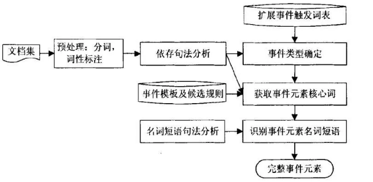

# 事件抽取技术介绍

## 简介

- 参考资料：<https://blog.csdn.net/lhy2014/article/details/82953913>
- 参考资料：[事件、事件抽取与事理图谱](https://blog.csdn.net/lhy2014/article/details/85806973)
-  ACE(Automatic Content Extraction)于2005年引入了事件抽取评测任务。事件抽取主要包含事件类型识别和事件元素抽取两个关键任务。其中事件元素抽取对充分理解事件起着至关重要的作用。近些年来，事件元素抽取的方法主要可以分为两类：一类是基于机器学习的方法，另一类是基于模式挖掘和匹配的方法。 

## 事件图谱（事理图谱）的类型

| 事件     | 含义                     | 形式化     | 事件应用 | 图谱场景          | 举例                |
| -------- | ------------------------ | ---------- | -------- | ----------------- | ------------------- |
| 因果事件 | 某一事件导致某一事件发生 | A导致B     | 事件预警 | 因果溯源 由因求果 | <地震,房屋倒塌>     |
| 条件事件 | 某事件条件下另一事件发生 | 如果A那么B | 事件预警 | 时机判定          | <限制放宽,立即增产> |
| 反转事件 | 某事件与另一事件形成对立 | 虽然A但是B | 预防不测 | 反面教材          | <起步晚,发展快>     |
| 顺承事件 | 某事件紧接着另一事件发生 | A接着B     | 事件演化 | 未来意图识别      | <去旅游,买火车票>   |

## 事件的表示

-   描述对象属性数据结构的框架Frame， ”脚本”表示方法，语义网络（Semantic Network） 。<https://blog.csdn.net/lhy2014/article/details/86470565>
-  事件表示是事理图谱中的重要问题之一，目前学界和业界正在寻求一种尽可能灵活、简单的方式去表示事件。在事件表示上，有上海大学刘宗田老师团队提出的“事件六要素本体模型”，即将事件建模成e = { A，O，T，V，P，L}的表示形式， 其中: A 为动作要素; O 为对象要素; T 为时间要素; V 为环境要素; P 为断言要素; L 为语言表现。 而这种表示方式无法直接用于图谱节点表示，更可能成为一种事件描述信息隐藏于图谱事件节点背后。
-  以因果事件为例：已知句子：这几天非洲闹猪瘟，导致国内猪肉涨价。

| 表示形式 | 含义                                                         | 举例                          | 优点                   | 缺点                     |
| -------- | ------------------------------------------------------------ | ----------------------------- | ---------------------- | ------------------------ |
| 短句     | 以中文标点符号为分割边界形成的短句                           | 这几天非洲闹猪瘟&国内猪肉涨价 | 方便、最原始信息       | 噪声多，不易融合         |
| 词序列   | 对短句进行分词、词性标注、停用词形成的词序列                 | 非洲闹猪瘟&国内猪肉涨价       | 语义丰富、较短句形式短 | 停用规则不易控制         |
| 短语     | 依存句法分析/语义角色标注，形成主谓短语、动宾短语、主谓宾短语 | 非洲闹猪瘟&猪肉涨价           | 语义凝固简洁           | 受限于依存、语义角色性能 |

## 难点分析

- 参考资料：[事理图谱：一种纯学术需求、无法落地、漏洞百出的新技术或新概念？](https://blog.csdn.net/lhy2014/article/details/102093751)
- **抽象事件界定模糊**。什么是事件？什么是抽象事件？怎样才算抽象？抽象事件怎么去显示它？这一系列问题到目前并没有论述清楚。此外，抽象的层级又如何去界定？这些问题都没有解释清楚。 
- 事件的**识别模糊**。抽象的事件，怎么去识别边界？整个事件的抽象问题都没有定义好，这使得抽取的过程沦为了一种思路，怎么抽都行。例如，“我吃了饭，然后去了学校”，识别的事件是“吃了饭”还是“我吃了饭”，“去了学校”，还是“去学校”。这种识别出来的抽象事件其实只是一个事件片段而已，就算抽取出来了，后续的一些再抽象等之类的算法，也只会造成误差传播，没法用。
- 事理图谱单事件链条的无效性。另外一个方面是多度的误导性。一旦从Ai出来，不断往后延伸，会得到一系列的Bj,Ck,Dm…等等，**越往后，整个链条的错误率其实越大**，原因是：1）抽象事件本身的问题，事件的抽象问题把握不好，A到B还说的是猪肉问题，B到C已经说到感冒问题，这类问题其实特别常见，本质问题是这种事件的上下文信息即语境信息太少，传递下来，语境变化太差，整个传到逻辑就是错的。2）错误的传播。每条因果关系边都是失真的，让他不断地往后走，失真的会越来越厉害。3）整个传播逻辑的取舍难度大。假设前2个问题都已经解决，从一个起始事件到一个终止事件，可以有很多种路径，但哪条路径的可能性最大，在实现上是很大的问题。

## 参考项目

### 刘焕勇项目

- 顺承事件图谱(https://github.com/liuhuanyong/SequentialEventExtration)
- 因果事件图谱(https://github.com/liuhuanyong/CausalityEventExtraction) 
- 中文复合事件抽取项目(https://github.com/liuhuanyong/ComplexEventExtraction) 

### 哈工大SCIR-基于依存句法和短语结构句法结合的金融领域事件元素抽取

- [参考资料：基于依存句法和短语结构句法结合的金融领域事件元素抽取](https://mp.weixin.qq.com/s?__biz=MzIxMjAzNDY5Mg==&mid=2650792252&idx=1&sn=8467f03d594c8d5b25658175381af9a6&chksm=8f4774d7b830fdc1041401d9de298ec44f1ca6e7f6f6cf8250c8d71ce19628b8c6d94f159f58&scene=21#wechat_redirect)；[参考资料：基于连通图的相关度计算与篇章级事件抽取](https://www.jiqizhixin.com/articles/2018-06-29-2)
-  提出该方法的原因：标注数据较为稀缺 。
- 事件类型确定。该部分进行**触发词**（用于标识事件的谓词,一般动词和名词居多）的**识别**，从而可以使得事件元素抽取系统依据匹配出的触发词类别进行后续的抽取工作。在后面的事件抽取系统中，我们对不同的触发词类别采取不同的抽取模式和候选规则进行抽取。
- 获取事件元素核心词。该部分**基于依存句法分析结合候选规则进行金融事件元素核心词的获取**。在系统中依存句法分析负责对有触发词的句子进行预处理，具体包括分词，词性标注，句法分析。事件元素抽取系统结合具体的捕取模式和手工设计的候选规则对进行过预处理后的句子进行事件元素核心词的抽取。
- 识别事件元素名词短语。该部分**基于短语结构句法分析识别完整的事件元素名词短语**。对于依存句法分析后的事件元素核心词，短语结构句法分析器负责对其所在的名词短语进行名词短语的识别，从而形成最终的完整的事件元素。

### 哈工大SCIR-抽象因果事理图谱的构建和应用

- 参考资料：<http://www.sohu.com/a/137802985_657157>
-  第一步是对新闻语料中的**因果提及进行抽取**。 使用了**规则模板**的方法 ： `<Pattern, Constraint, Priority>`。Pattern 是包含因果关系触发词的正则表达式；Constraint 包含了一些句子中的句法约束，例如 `after[sentence1], [sentence2]` 这个模板中，sentence1 必须不能是数字打头的句子；Priority 是当多个模板都匹配上时，匹配模板的优先级 

-  接下来从原因结果事件的描述句子中**抽取原因事件和结果事件**。此处，我们把事件描述句子中的动词和名词集合来表示事件。原因有三点：首先，这是由数据集的特性决定的。我们使用的语料是 NYT 的新闻标题。众所周知，新闻标题追求简洁性和正确性。标题中多以名词和动词组成。因为动词和名词的语义信息丰富；其次，我们尝试了三元组或者名词短语的形式表示事件。发现这样会丢失掉新闻事件中非常重要的主干信息；最后，如果**使用三元组或者名词短语表示事件**，那么一个事件描述中常常能抽取到多个三元组或者名词短语。判断使用哪一个来表示事件也是一个难题。为了保证我们抽取到的事件正确性和完整性，我们**选择用动词和名词组成的集合的形式表示事**件。这样我们抽取到的事件既可以包含所有**三元组（subject，predicate，object）的信息，也包含了名词短语的信息，还包含了动词短语的信息**。另外还包含了其他的一些重要的名词和动词所蕴含的事件信息。 

-  对事件做泛化处理，即**同一类的事件归为一个事件**，即不管四川地震还是熊本地震都归为地震这个事件。这种泛化后的事件常常是表征一类事件，因此我们称之为抽象事件，如图1所示。通过观察我们发现在具体事件的词集合表示中，如果以包含三元组的词集合事件为例，有的事件模式是 predicate+object 总固定出现而 subject 却是动态变化的，有的是 subject+predicate 总是固定出现而 object 却是动态变化的。另外也存在一些更加复杂的模式。此处我们**采用高频词对的形式来具体表示抽象事件**。即不管 predicate+object 还是 subject+predicate 或者其它的组合，**哪个组合形式具有更高的频次我们就用哪个组合来表征这个抽象事件**。在从具体事件到抽象事件的泛化过程中我们还把**每个动词用 verbnet 里面的动词类别替换**，**名词用上位词或者高频同义词替换**。 
-  **实验结果表明：1）高频词对形式的抽象事件因果是非常高效且合理的表示方法；2）利用前因后果对事件的表示学习由于学习到事件的因果上下文，所以在事件分析预测和股市预测上表现出了优越性**。 

