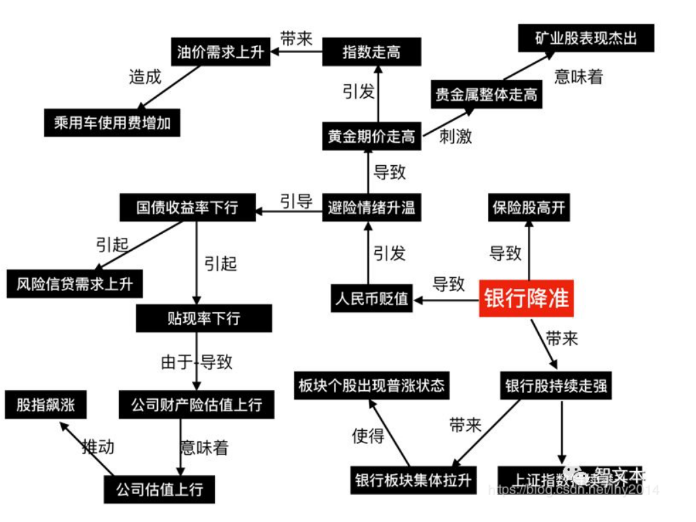
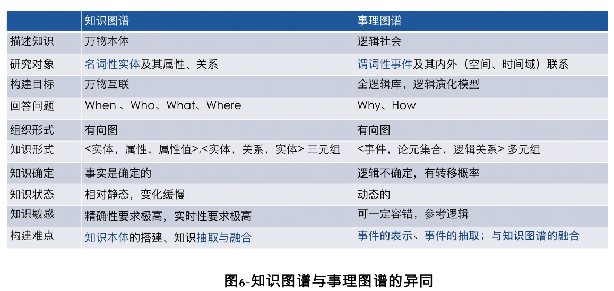
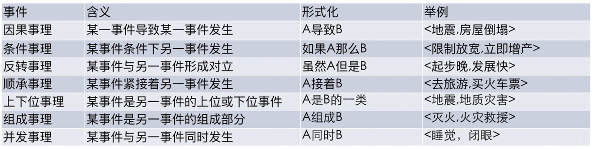
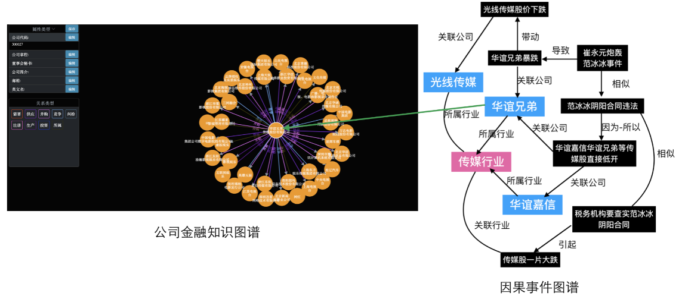

# 事理图谱介绍

## 简介

- 参考资料（ [liuhuanyong_iscas](https://me.csdn.net/lhy2014) ）：<https://blog.csdn.net/lhy2014/article/details/90522846>
-  事理图谱以事件为描述核心，以揭示事件之间的演化逻辑关系 。事理图谱”这个词是国内哈工大刘挺老师首次提出，与此同时较该团队之前有类似的工作，如中科院软件所、数据地平线公司的工作，也叫事理图谱。目前见学术文章的以刘挺老师的团队为例。英文版本，出现过EEG(Event Eventionary Graph)，或后面的(Abstract Event Graph)，或后面的ELG(Event Logical Graph)，定义上而言，为“事件演化的规律和模式”。

## 从知识图谱到事理图谱

- 从**知识图谱的本质**上来说，是以**传统本体概念为基础**进行知识组织的，而在知识处理领域，这种传统本体概念依然存在着一些局限性，传统本体对于概念的描述**着重对其静态特征的描述，缺乏对动态特征的描述**，经典的“网球”问题就是典型的例子。实际上，许多哲学家认为世界是物质和运动的，物质和运动的世界是由事物和事件组成，物质是相对静态的知识形式，反映了客观世界中事物存在的规律。然而，人类的命题记忆是以“事件”为存储单位的，存储的是组成事件的概念及其之间的关系以及事件及其之间的关系。以事件作为知识的基本单元更能反映客观世界的知识，特别是**知识的动态性**，从认知心理学的角度来看，事件更符合人类的理解与思维习惯。人类主要是以“事件”为单位进行记忆和理解现实世界的，事件关系到多方面的概念，是比概念粒度更大的知识单元。传统本体所使用的概念模型难以反映事件这一更高层次和更复杂的语义信息，模型缺少了更高层次的结构。
- 从知识刻画上来说，知识图谱的局限主要体现在两个方面：一是对人类知识的刻画上上不具备动态属性。知识图谱中所刻画和描述的知识是静态的非黑即白的一种确定性事实，而现实人类社会当中，知识是动态变化的，知识本身会因为外部条件的变化而失真。另一个是知识图谱在应用上的一种局限性，**知识图谱只能回答什么是什么的问题**，对包括基于已知知识推断未知知识，对已知知识进行正确性校验的知识推理，从根本上来说也没有跳出“静态”这一属性。**在诸如“怎么了”，“接下来会怎么样？”，“为什么”，“怎么做”等问题上，知识图谱显得有些乏力**。<https://blog.csdn.net/lhy2014/article/details/85247268>

## 事理逻辑分类

- 传统概念之间的分类关系即上下文关系不同，事件与事件之间除了上下位等分类关系外，还存在非分类关系，包括组成关系、因果关系、并发关系、条件关系、排斥关系等，这些关系一起对现实动态知识种的逻辑知识进行了描述。事理逻辑的几种类型主要包括因果事理、条件事理、反转事理、顺承事理、顺承事理、上下位事理、组成事理、并发事理共七类事理：

## 图谱分类

-  在文本分析中，事理图谱可以是一种时间线或故事线叙事链条，在流程性业务中，事理图谱可以是业务状态序列，等等。 总结性地认为，根据事件外部表示以及关系的不同，事件类知识图谱主要包括事件知识图谱、抽象事理图谱、事件逻辑知识图谱、领域状态事件决策图谱四种类型。 

### 1、事件知识图谱 （event knowledge graph） 

事件知识图谱，在这里，我们认为这个图谱本身更倾向于为一个事件知识库，事件知识图谱的工作主要围绕事件知识本身进行展开，**关注点在于事件内部信息**，如ACE中的8大类事件，将这几类事件中的信息进行抽取和填充就能够得到一个以特定事件类型作为分类标准的事件知识库，如婚姻事件库、爆炸事件库等。最近的工作包括金融事件知识图谱的工作，集中于资产冻结等少数几个特定事件的事件知识图谱。**这种事件知识图谱中的事件由特定的事件类型及其事件论元槽构成，内部关系主要考虑包括事件论元之间的关联，对外部事件之间的关联关注较少。**

### 2、抽象事理图谱 （abstract event evolutionary graph） 

抽象事理图谱，最早由哈工大信息检索实验室在narrative chain的基础上提出，**目标是揭示事件之间的演化性，关系上主要考虑顺承和因果两种，在事件节点的设置上倾向于事件的抽象性**，以原文短句的形式作为字符串表示，这种抽象性质决定了该事件不具备更为细致的内部事件信息，形式上很为简洁。**但存在的挑战很多，例如如何抽象，抽象的力度如何控制，不同的抽象粒度会得到不同的抽象结果，适用场景也会因此而相对受限**。

### 3、事件逻辑知识图谱 （event logic knowledge graph） 

事件逻辑知识图谱，是综合事件知识图谱和抽象事理图谱之间的一种知识图谱类型，该知识图谱既保留了事件知识图谱中事件内部信息的完备性，又保留了抽象事理图谱中外部事件表示的抽象性，具有完备性和抽象性双重特征。不过，事件逻辑知识图谱与事件图谱不同，**事件逻辑知识图谱规避了事件知识图谱的领域特征，而采用统一的事件槽，即通用的事件N个论元组对事件表示，其中论元的设置综合考虑了回答5个W，1个H的问题的同时，更考虑事件的情绪、确定性、完成性、主观性、权威性等信息，并通过领域实体的增加与替换来达到对不同领域的适配**。本质上来说，事件逻辑知识图谱的核心在于逻辑，而这种逻辑的本质特性是抽象性，因此事件之间的逻辑关系需要从底层的事件进行高度抽象而成，这种抽象主要体现在事件逻辑知识库中事件外部形式的表示上。与抽象事理图谱不同，由于有了底层具有丰富内部属性的实例事件作为支撑，可用于事件抽象的信息更多，在事件融合方面带来了极大的便利，另外在事件之间的关系上，进一步进行扩展，可以形成对立、条件、部分与整体等多种逻辑网络。我们团队目前主要在这一类事理图谱上做了大量基础和探索性的工作。

### 4、领域状态事件决策图谱

领域状态事件决策图谱，**主要侧重状态事件和决策图谱两个部分，更偏向于描述具有典型业务流程的领域，状态事件部分完成对业务流程的抽象和梳理**，如电器维修场景下，电器维修整个业务询问链条的构建，什么电器，什么故障，如果是冰箱制冷故障的话，是制冷机坏了，还是供电问题，将这些步骤进行梳理，抽象成一个个事件状态，并为后期的决策部分提供基础事件性的支持。这种事件决策图谱在**业务流程较为规范的场景下可以有一定应用**，通过对业务流程抽象出来，能够提升业务买方和业务卖方之间的沟通效率。

##  事理图谱的领域性分类 

作为知识图谱的一个变体，事理图谱很自然地继承了知识图谱的性质，这种性质更多的体现在知识的领域性，知识图谱根据不同的领域可以进一步细分为百科类常识知识图谱、语法语义类知识图谱、金融领域知识图谱、医疗领域知识图谱等等，不同的知识图谱类型决定了其应用场景的可行性、难易度以及广度。事理图谱在领域上主要可以分成常识性事理图谱、风险类事理图谱以及触发类事理图谱。

### 1、常识类事理图谱
常识类事理图谱，与百科类知识图谱类似，**主要目的是刻画具有常识性的逻辑**，如不喝水会很渴；长时间不睡觉会犯困；吃饭之前得先做饭；炒菜之前需要准备食材；打雷时先看到闪电再听到雷声等等，**这类常识性的逻辑能够应用于闲聊问答任务**。例如：

问题:为什么要读书
回答: [‘赚钱！’, ‘读书改变命运’, ‘读书可以改变你的容貌’, '为了融入社会，必须读书]

问题:为什么要有女朋友
回答: [‘为下一代’, ‘因为你需要女朋友’, ‘男女搭配.干活不累’]

以上列举了两个闲聊式问答的例子，这种闲聊问答方式能够补充静态性的简单百科知识问答，增加问题域的广度和提升用户提问积极性。

### 2、风险类事理图谱
风险类事理图谱，根源于决策逻辑，目的于风险控制，**以提前掌握事件演化规律为前提，对未来发生的事情进行提前预知并防患于未然，它作为人们对现有逻辑知识的总结和归纳，并指导未来工作**，是涉及范围最广的一种事理图谱。从技术实现方式上来看，**包括事件逻辑建立和事件风险分类两个子任务**。事件逻辑建立可以通过机器进行自动挖掘，也可以使用人工手动编辑录入，依靠后套逻辑知识数据进行推荐摘录的方式进行。由于就风险控制而言，风险事件之间的影响事件会有很多，因此构建起来的数据大多是一种局部、分散的事理影响逻辑。为了规避这种问题，在风险我们做了一定的尝试，放在本文第三个部分详细叙述。

### 3、触发类事理图谱
触发类事理图谱，通常指**在业务流程型较强的一种图谱，主要有三大要素构成，分别是原事件、触发条件以及触发结果事件**。这类图谱在医疗领域和司法领域使用较多，比如医疗领域之间的药物病理触发图谱、挂号流程触发图谱，司法领域的处罚条例事理图谱等在建成后将有重要应用价值。

## 应用

- 公司因果逻辑事件的风险分类
  我们以A股3600多家公司为例，采集了从2009年至今10年共计1200万的公司个股新闻资讯，应用因果事件抽取方法，抽取形成了唯一事件规模约400万，因果事件关系240万的因果事理图谱，在因果事件抽取准确率方面，通过人工标注9000条因果对，准确率达到86.4%。以此图谱数据作为后台数据，设计风险分类方法，对400万事件数据进行了风险分类，得到共计73万，风险细类别数目达到140类的A股事件风险库。具体事件定义说明参考：<https://blog.csdn.net/lhy2014/article/details/90522846>

- 应用探讨： 基于事理图谱的知识问答，基于事理图谱的消费意图识别，基于事理图谱的重要新闻判别与推荐，基于事理图谱的知识管理，基于事理图谱的推理与辅助决策   <https://blog.csdn.net/lhy2014/article/details/85247268>
  

## 样例展示

-  图文示例：基于金融事理图谱的新闻预警 ， 基于事理抽取技术的文本可视化 ， 基于出行事理的路径规划与推荐 ， 基于事理图谱模型的历时事件流生成 ：<https://blog.csdn.net/lhy2014/article/details/86542630>
-  **超详细的介绍：全行业动态事理图谱**， 2000万的历史多行业资讯库，总结出上百种因果事件模式。基于显式因果模式，经过事件标准化、事件对齐、事件融合等处理后，最终形成了具有动态更新能力的多行业领域事理图谱 ：<https://blog.csdn.net/lhy2014/article/details/86516706>
-  哈工大SCIR**金融事理图谱demo**：<http://eeg.8wss.com/main>
-   数据地平线的金融事理图谱Demo：<http://eg.zhiwenben.com/>；详细介绍：<https://blog.csdn.net/lhy2014/article/details/103058140>

## 与知识图谱的融合

如上面所介绍到的事理图谱中是以事件为单位一种逻辑链路，而实体识事件的一个重组成部分，通过**实体识别和实体链接技术可以将事件中的实体链接到相应的实体知识库当中**。如图12所示：“范冰冰阴阳合同违法”这一事件当中，人物“范冰冰”可以链接到包含“范冰冰”这个人物的人物关系图谱，如搜狗人物关系图谱，导致光线传媒、华谊嘉信、华谊兄弟等传媒公司的股价下跌这一事件中，光线传媒、华谊嘉信以及华谊兄弟这些公司类实体，实体可以进一步连接到以公司为实体的公司金融知识图谱，该图谱中包含了公司的主营产品、所属板块、竞争对手等各方面的信息，图11显示了融合前的状态。

