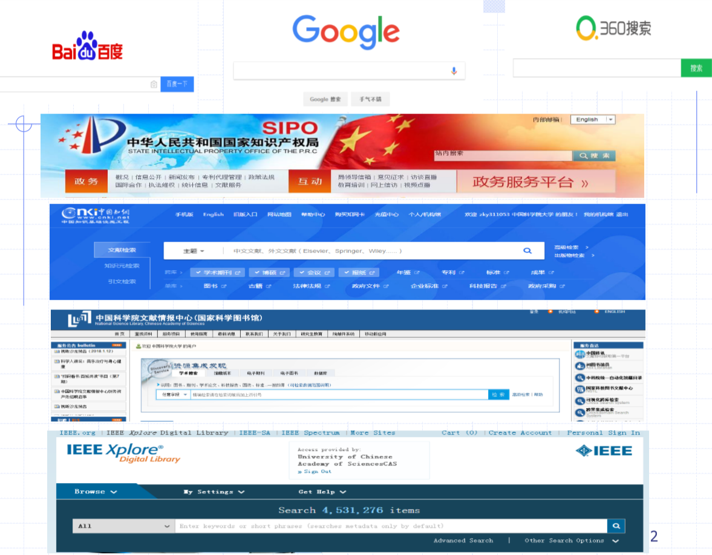
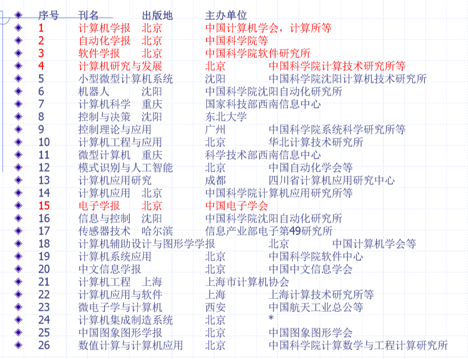

# 文献阅读

- **优先关注综述性论文和书籍 **
- 关注文献本身所引用的参考文献 
- 不断缩小搜索的范围 
- 给你的检索结果做标签 ，以备重复现在的检索
- 适可而止 

## 引文格式

- 所有文献根据在文中出现的先后顺序引用
- 引用格式 
- 单篇（2篇以下）
  - [1]
  - [1,2] 
- 连续多篇(3篇以上)
  - [1-3]
  - [1-5] 
- 间隔多篇
  - [1,3,4]
  - [1,3-5] 
  - [1-3,6]

### 学位论文

- [序号] 主要责任. 文献题名[D]. 保存地: 保存 单位, 年份.
- 例如： [7] 张和生，地质力学系统理论［D］．太原：太原 理工大学，1998．

### 连续出版物（期刊）

- [序号] 主要责任者. 文献题名[J]. 刊名, 出版年份, 卷号(期号): 起止页码．
- 例如：[1] 袁庆龙，候文义．Ni-P合金镀层组织形貌及显微硬度 研究[Ｊ]．太原理工大学学报，2001，32(1)：51-53. 
- 例如：[2] DES MARAIS D J, STRAUSS H , SUMMONS R E, et al. Carbon isotope evidence for the stepwise oxidation of the Proterozoic environment [J]. Nature, 1992,359:605-609.

### 专著

- [序号] 主要责任者. 文献题名[M]. 出版地: 出版者 , 出版年: 起止页码（可选项）.
- 例如：[3] 刘国钧，王连成．图书馆史研究［Ｍ］．北京：高 等教育出版社，1979：15-18，31．（页码不必须）
- 例如：[4] 广西壮族自治区林业厅.广西自然保护区[M].北京 :中国林业出版社,1993. 

### 论文集

- [序号] 主要责任者. 文献题名[C]. 论文集名. 出版地: 出版者, 出版年:起止页码.
- 例如：[5] 孙品一. 高校学报编辑工作现代化特征[C]. 中国 高等学校自然科学学报研究会. 科技编辑学论文集(2). 北京: 北京师范大学出版社, 1998: 10-22
- 例如：[6] 中国力学学会.第3届全国实验流体力学学术会议 论文集[C].天津:[出版社不祥],1990.

### 报告

- [序号] 主要责任. 文献题名[R]. 报告地: 报告会 主办单位, 年份.
- 例如： [8]冯西桥. 核反应堆压力容器的LBB分析[R]. 北京: 清华大学核能技术设计研究院, 1997.

### 专利文献

- [序号] 专利所有者. 专利题名[P]. 专利国别: 专 利号, 发布日期.
- 例如： [9] 姜锡洲. 一种温热外敷药制备方案[P]. 中国专利 : 881056078, 1983-08-12.

### 电子文献

- [序号] 主要责任者.电子文献题名[文献类型/ 文献载体]. 发表或更新日期(可选)[引用日期 ]. 获取和访问路径. 
- 例如： [12] Fonda, Marc. Examining the New Polytheism: A Critical Assessment of the Concepts of Self and Gender in Archetypal Psychology[EB/OL]. 1995[1997-12-20] University of Ottawa, http://www.clas.ufl.edu/ users/ gthursby/fonda/dispg.html. 
- 例如：[13]Online Computer Library Center, Inc. History of OCLC[EB/OL]. [2000-01-08]. http://www.oclc.org/about/history/default.htm.

### 国际、国家标准

- [序号] 标准代号, 名称[S]. 出版地: 出版者, 出版年.
- 例如： [10] GB/T16159-1996, 汉语拼音正词法基本规则 [S]. 北京: 中国标准出版社, 1996.

### 报纸文章

- [序号] 主要责任者. 文献题名[N]. 报纸名, 出版日期(版次).
- 例如： [11] 谢希德，创造学习的思路[N].人民日报， 1998-12-25(10)．

## 文献网站

- 知识产权局SIPO
- 中国知网
- 中国科学院文献情报中心（国家科学图书馆）
- IEEE Xplore

- **阅读要求**：至少20篇；包含国内核心期刊、国外期刊、国（内）外会议、国（内）外专利、书籍、网页等各类参考文献至少一篇。
  - 网页文献有且仅有1篇
  - 国内核心期刊、国外期刊文献至少各3篇
  - 近五年的文献不少于30%
  - 综述不少于3000字，Word版，文件命名“序号-学号-姓名.doc”。

### 国内核心期刊

### 国外期刊

### 国内会议

### 国外会议

### 国内专利

### 国外专利

### 书籍

### 网页

## IT领域常用文献资源

### 电子文献数据库

- IEEE: https://ieeexplore.ieee.org/Xplore/home.jsp
- ACM：https://dl.acm.org/
- 中国知网：http://www.cnki.net
- 万方数据库：http://www.wanfangdata.com.cn/index.html
- 维普：http://www.cqvip.com/

### 国外著名学术刊物

- IEEE和ACM的汇刊等
- 国际四大索引：
  - 科学引文索引 (SCI)
  - 工程索引 (EI) 
  - 科学评论索引 (ISR) 
  - 科学技术会议录索引 (ISTP)

### 自动化、计算机技术类核心期刊表

## 常用文献数据库

- Web of science (SCI/CPCI) 
- Ei Engineering Village 2 (EI) 
- Chinese Social Sciences Citation Index （CSSCI）
- 专利数据库
- 期刊论文库
- 硕博论文库 

## 文献管理软件

### PowerRef 

### 医学文献王

- http://refer.medlive.cn/
- 激活码零售价**99**元
- 《医学文献王》分为标准版和专业版两个版本，标准版具有软件的核心功能，只要是医脉通用户均可免费使用。专业版授权软件的全部功能，标准版输入激活码后即可激活为专业版。

### ProCite

- https://quod.lib.umich.edu/j/jahc/3310410.0003.114?rgn=main;view=fulltext
- Download version, $229.95; Shipped version, $355.95; Student version, $99.95.

### *Mendeley

- https://www.mendeley.com/?interaction_required=true
- 免费，免费 2G 存储空间，约能存储 1000 千篇文献。
- [Mendeley](https://www.mendeley.com/) 于2013 年以开源软件身份被 Elsevier 高价收购，目前背靠大树。
- 真全平台：Web, macOS, Linux, Windows, iOS, Android 设备上所有文献随时随地阅读。
- 缺点：内置阅读器不够强大，分辨率也不是很高；不支持类 Zotero 多附件插入和树状目录，和Zotero 相比笔记功能也比较简陋。

### Zotero

- https://www.zotero.org/download/

- Zotero 300M。

- 在官方网站中，有一篇文章专门替用户剖析了 [为什么要使用 Zotero](https://www.zotero.org/why)。以下是我把其当做自己主力文献管理的几个主要原因：https://sspai.com/post/56724

  - 软件本身完全免费并且开源，不存在盗版问题
  - 注册后本身只包括 300M 空间同步，但支持 WebDAV 同步，例如 Dropbox 和坚果云等
  - 官方的反馈论坛比较活跃，有问题可以快速得到反馈
  - 从网站和期刊文章等提取保存出版物数据检索
  - 拖入 PDF 的出版物数据准确率高
  - 可以和 Word，LibreOffice 集成，方便文献进一步的使用管理
  - 强大的第三方插件系统
  - 每个条目下可以添加任意数量和格式的附件
- 当然，使用一个工具首先要了解其上限和下限，Zotero 同样有着比较明显的短板：
  - 因为强大所以上手时略显复杂
  - 并不是一个完全基于 Web 的工具
  - 没有内置的 PDF 阅读工具
  - 没有适配于 iOS 和 Android 的官方应用程序

### NE 

### Bookends

- https://www.sonnysoftware.com/bookends/bookends.html
- 如果文献很多，且对文献管理要求较高的话，可以入手。如果文献不是很多，免费的mendeley就足够了。
- Bookends requires Mac macOS 10.10 or later (including Catalina, macOS 10.15).

### Library 

### Master 

### Papyrus

### NoteFirst

- http://www.notefirst.com/pay/
- 500M免费

### NoteExpress

- 价格：¥998
- NoteExpress是国内开发的较为优秀的一 款文献管理软件。
- 优点：功能较EndNote丰富，且符合中国人 使用习惯，中文支持良好，并且与Word支 持的比较好。
- 缺点：软件历史较短，细节之处不太完美

### Biblioscape

- Biblioscape并不能简单地归入到文献管理软件 中来，因为它的功能非常强大，它不仅是文献 管理工具，还包括文献分析工具；另外 Biblioscape版本众多，适合不同研究者需要。
- Biblioscape对中文支持的比较早，不过到现在仅支 持gb2312编码，不支持utf-8。
- 另一个较严重的缺点是对Word的支持不如前两者好 

### ReferenceManager

- ReferenceManager也很不错，但与 EndNote功能差不多，并且被ISI公司收 购后，更新并不积极。
- 缺点：不支持中文，所以用的也不多

### EndNote

- https://www.endnote.com/
- 收费版，RMB 1,200.00
- 毫无疑问，EndNote是文献管理软件中的老大 ，大名鼎鼎的ISI出品。 
- 优点：界面简单，搜索查询方便，与Word无缝链接 ，支持Z39.50标准，可以检索所有支持此标准的数 据库，支持gb2312和utf-8编码，中文支持良好。
- 缺点：不能建立子目录，无法分类。