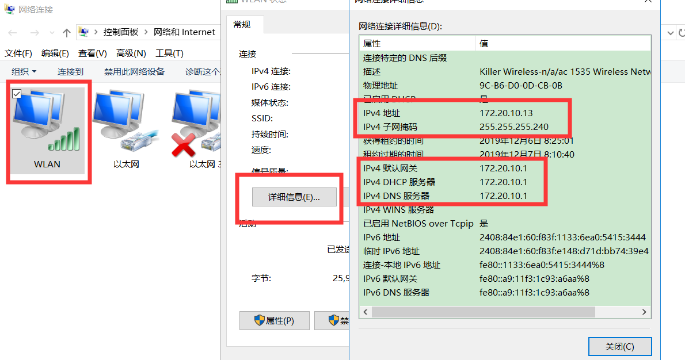
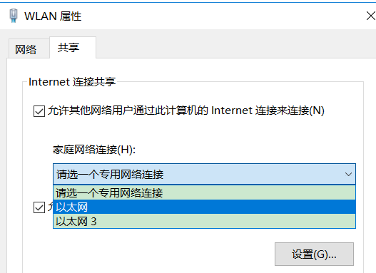
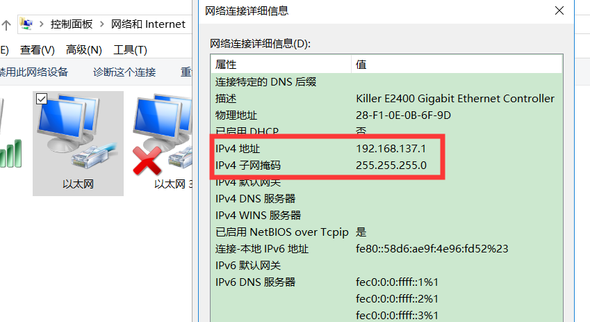

# Centos直连PC机进行上网

- 参考资料：https://blog.csdn.net/iteye_19209/article/details/82675399

## 简介

- centos为离线服务器，PC机为windows系统，可以上网（WiFi）。
- 通过一根网线，将其直连，进行如下配置，将Centos接入互联网。

## 配置流程

### 查看PC机网络配置

- 控制面板\网络和 Internet\网络连接，查看PC机网络配置

~~~python
我的配置，记作WLAN：
IP地址: 172.20.10.13
子网掩码：255.255.255.240
网关：172.20.10.1
DNS：172.20.10.1
~~~

- 设置网络共享：属性-共享

- 设置共享后，查看共享的网络连接的状态

~~~
记作以太网：
IP地址：192.168.137.1
子网掩码：255.255.255.0
~~~

### 配置centos的网络

- 修改网络配置

~~~
cd /etc/sysconfig/network-scripts
#   cp ifcfg-eno1 ./ifcfg-eno1.bak //修改前可先备份，可选项
vim ifcfg-eno1  # ifcfg-eth0
~~~

- 记录以前配置

~~~
IPADDR=192.175.1.14
NETMASK=255.255.255.0
GATEWAY=192.175.1.1
~~~

- 配置修改

~~~
IPADDR=192.168.137.14  # 配置成与以太网的IP同网段的IP
NETMASK=255.255.255.0  # 配置成与以太网的子网掩码一致
GATEWAY=192.168.137.1  # 配置成与以太网的IP一致
DNS1=172.20.10.1  # 配置成与WLAN的DNS一致
IPV6_PEERDNS=no
IPV6_PEERROUTES=no
~~~

- 设置配置生效

~~~
service network restart
~~~

- 互相ping一下，看是否正常。