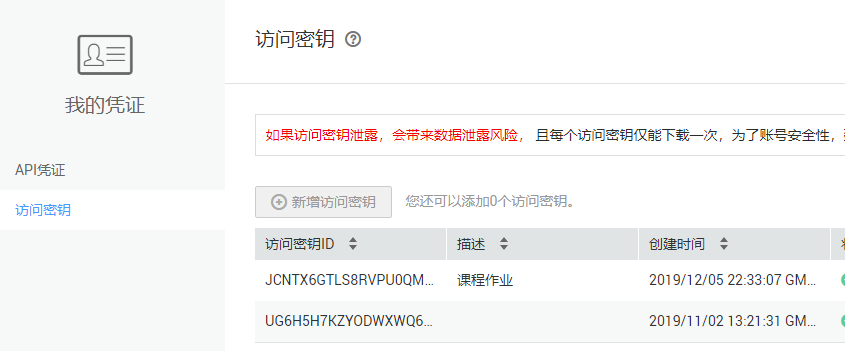
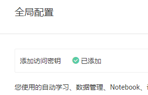
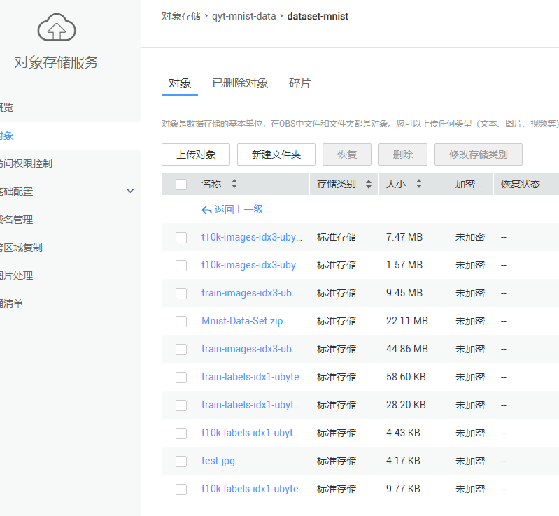
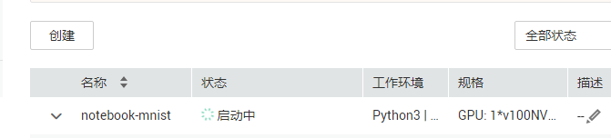

# 手写数字识别

- official example 6：在Notebook中，使用MoXing框架训练模型并预测，实现手写数字识别的应用。

## 步骤

### 获取账号AK/SK

- 参考网址：https://support.huaweicloud.com/prepare-modelarts/modelarts_08_0002.html

- 管理控制台设置，网址：https://console.huaweicloud.com/modelarts/?region=cn-north-4#/manage/dataLabel_Beta

### 在OBS服务中创建桶和文件夹

- 数据集上传：https://storage.huaweicloud.com/obs/?agencyId=06a07eb887000f241fe0c01684f11bd8&region=cn-north-4&locale=zh-cn#/obs/manager/buckets
- 上传参考：https://support.huaweicloud.com/usermanual-obs/zh-cn_topic_0045829660.html

### 训练

- 启动

