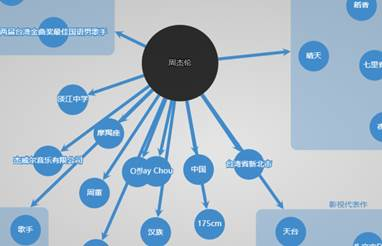

## 第一次作业

1. 类别：实际案例

2. 应用领域：通用

3. 问题描述：各类百科数据收集、整理与存储

4. 大数据特征：数据量较大（包括各类百科词条页面中的基本词条三元组信息，词条简介信息，词条详细描述，词条编辑修改时间，点赞数等等各类文本信息。每个百科基本都有千万级甚至上亿级别的词条数据），数据类型多样（包括纯文本信息，词条图片，甚至词条视频，词条的HTML页面等），数据时效（希望尽可能收集新的词条数据，并且可以及时将百科中新录入的词条信息及时获取补充到数据库中）。

5. 数据采集：数据来源（首先是一些公开的可直接进行下载的数据集，其次是各个百科站点，例如维基百科，百度百科，国搜百科等），数据采集方法（公开数据集可以直接下载，比如wikdata、freebase，以及Wikipedi会定时更新可供下载的数据压缩包，那些只能通过网页进行访问的百科数据则需要使用爬虫技术进行收集，因爬虫获取该类数据需要消耗大量的时间，以及存在各类反爬虫机制，这也是需要对该类数据进行系统性收集存储的原因之一）。

6. 数据存储：数据存储可以选用文档数据库，例如MongoDB或CouchDB。原因：文档型数据库允许每个对象有任意数量的字段，甚至允许对象作为值以任意深度嵌套到其他字段中。由于文档型数据库不像关系数据库那样彼此相关，它们比较容易在几个服务器上实现分片和复制，这使得分布式实现相对简单。文档数据库适合于涉及高度可变领域的问题。百科类数据字段各式各样，变化很多，对于此类型的数据存储，文档型数据库是一个不错的选择。此外，由于文档型数据库的性质，它们往往能很好地映射到面向对象编程模型。这意味着在数据库模型和应用模型之间移动数据时，阻抗性不匹配的情况较少，因此对于使用编程语言进行存储与后续提取数据进行分析非常有帮助。文档型数据库也有全面的索引支持，可以在任意属性上建立索引，这对后续的数据分析操作极为有利。

7. 数据分析：首先对各个来源的数据进行规整，使各个词条都有类别，类别缺失的词条可以使用NLP技术进行推理补充。利用自然语言处理的方法对词条进行消歧，实体链接与对齐，构造关系网。使用已有数据，提取新的关系等。

8. 数据可视化：将上一步规整好的数据，存储到图数据库（例如Neo4J，图数据库适合节点之间的高度相互关联的网状数据）中，然后使用关系网的形式进行展示，如下图。

9. 结果价值：可以对全网的通用实体进行关联分析，建立多层级的复杂关系；可以基于整理好的数据，进行交互探索式分析，模拟人脑去发现、求证、推理，例如应用到智能问答中；基于海量知识，让计算机形成认知能力，去理解这个世界，帮助人类完成很多任务。

