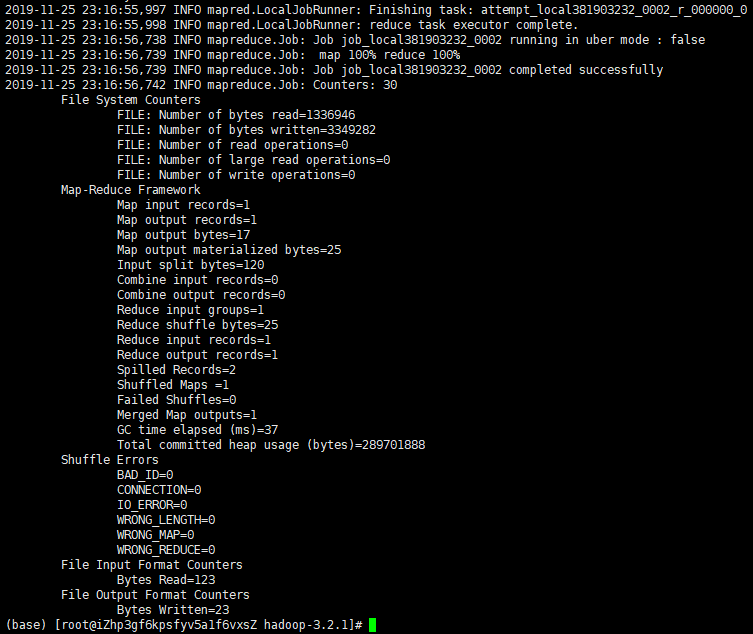

## 大数据技术概论-第三次作业

学号：2019Z8020661027

姓名：乔咏田

## 题目：

Hadoop安装练习

## 答案：

- 参考网站：<https://www.cnblogs.com/wangxin37/p/6501484.html>;<http://hadoop.apache.org/docs/r1.0.4/cn/quickstart.html>
- 基础环境：CentOS7

### 安装步骤

- 安装配置Java环境变量

~~~
(base) [root@iZhp3gf6kpsfyv5a1f6vxsZ ~]# java -version
java version "1.8.0_201"
Java(TM) SE Runtime Environment (build 1.8.0_201-b09)
Java HotSpot(TM) 64-Bit Server VM (build 25.201-b09, mixed mode)
~~~

- 下载，解压，Hadoop

~~~
wget https://www.apache.org/dist/hadoop/common/hadoop-3.2.1/hadoop-3.2.1.tar.gz  # 下载
tar -zxf hadoop-3.2.1.tar.gz  # 解压
~~~

-  显示**hadoop** 脚本的使用文档，`bin/hadoop`

~~~
(base) [root@iZhp3gf6kpsfyv5a1f6vxsZ hadoop-3.2.1]# bin/hadoop
Usage: hadoop [OPTIONS] SUBCOMMAND [SUBCOMMAND OPTIONS]
 or    hadoop [OPTIONS] CLASSNAME [CLASSNAME OPTIONS]
  where CLASSNAME is a user-provided Java class

  OPTIONS is none or any of:

buildpaths                       attempt to add class files from build tree
--config dir                     Hadoop config directory
--debug                          turn on shell script debug mode
--help                           usage information
hostnames list[,of,host,names]   hosts to use in slave mode
hosts filename                   list of hosts to use in slave mode
loglevel level                   set the log4j level for this command
workers                          turn on worker mode

  SUBCOMMAND is one of:
~~~

## 安装后运行

-  运行 grep 例子，将 input 文件夹中的所有文件作为输入，筛选当中符合正则表达式 dfs[a-z.]+ 的单词并统计出现的次数，最后输出结果到 output 文件夹中。

~~~
mkdir input

# 将配置文件作为输入文件
cp ./etc/hadoop/*.xml input/  
# 筛选符合规则的单词并统计其出现次数
./bin/hadoop jar ./share/hadoop/mapreduce/hadoop-mapreduce-examples-*.jar grep ./input ./output 'dfs[a-z.]+'          
~~~

- 查看运行结果

~~~
cat ./output/*
~~~

## 自带案例运行

-  复制一个文本文件到hdfs

~~~
./bin/hadoop fs -put LICENSE.txt input
~~~

- 运行wordcount

~~~
./bin/hadoop jar ./share/hadoop/mapreduce/hadoop-mapreduce-examples-*.jar wordcount input/*.txt output_txt
~~~

- 查看结果

~~~
./bin/hadoop fs -cat output_txt/part-r-00000
~~~

## 系统信息

-  查看系统信息：`uname -a`

