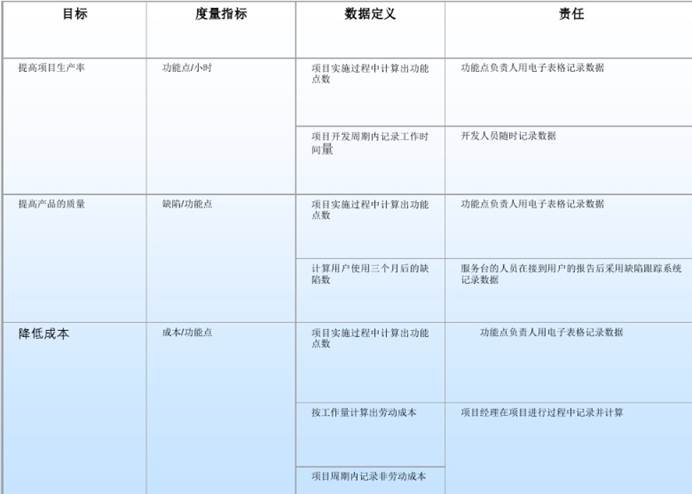

## 小题1-软件过程与生命周期

### 题目

比较软件过程与软件生命周期，想告诉什么事情？（Software Process vs. Software Life Cycle）

### 章节

**ppt-03-P02**；Lecture-2-SProcess-8.0-P8

### 答案

1、软件生命周期是软件产品从构思到结束（不可用）的一段时间。它通常包括概念阶段、需求阶段、设计阶段、实现阶段、测试阶段、安装和检验阶段、操作和维护阶段，有时，还包括退役阶段；是对软件开发和演化过程中发生的活动的高级定义；它是一个宏观的概念；没有详细的定义-侧重于高级别活动及其相互关系；所有的软件开发都贯穿于一个生命周期，从最初设想软件到软件退役；

2、与软件生命周期模型相比，软件过程模型通常表示一系列活动、对象、转换和事件的网络化序列，这些活动、对象、转换和事件体现了实现软件开发和演化的策略；也称为软件生命周期过程；它是一个微观的概念；

3、软件过程模型比生命周期模型更详细；不要试图对软件过程进行时间上的排序；

原则上，可以将软件过程安排为适合任何生命周期模型。

## 小题2-成熟度与能力等级比较

### 题目

CMMI成熟度与能力等级？以及其关系？

### 章节

**ppt-04-P05**；Lecture-3-CMMI-Fundamental-6.0-P43

### 答案

1、成熟度（Maturity）：代表一个组织基于预先定义的实践领域集的绩效和过程改进工作的阶段性路径；它是分阶段的，每个成熟度级别建立在以前的级别之上，通过添加新功能提升等级；

2、能力等级（Capability Levels）：适用于组织在各个实践域的绩效和过程改进成果；它定义了20个实践域，强调的是单个实践域的能力与持续改进，关心的是单点的实践域；

3、成熟度或能力等级提供了一种描述其能力和性能的方法；阶段式表示法相对于整体，成熟度级别来描述组织过程总体状态的特征；连续式表示法相对于单个过程域，使用能力等级来描述组织过程状态的特征。

## 小题3-TSP与PSP

### 题目

比较PSP（Personal Software Process）与TSP（Team Software Process）

### 章节

**ppt-06-P14**；Lecture-5-Using CMMI_2_-3.0-P82

### 答案

1、 PSP个人软件过程：它是包含过程、表单、模板和度量的软件生命周期；内置高质量和可靠性，质量、成本、生产率和周期时间的改进；它是个人的5级过程，也是TSP的先决条件；强调工程师规划自己的工作，自己定义测量流程与做好质量工作；关注的是个人技能构建；

2、 TSP团队软件过程：它是一个由2到20名成员组成的，由PSP培训的软件工程团队的过程；将其视为团队的5级过程；它构建并指导跨职能团队；关注的是团队构建；

3、 TSP是一个成熟的过程，旨在帮助团队实现最佳性能；PSP是TSP的先决条件；TSP和PSP是在所有成熟度级别改进组织过程的工具。

4、 CMMI的某些实践域涉及PSP与TSP，当使用PSP和TSP时，CMMI阶段性表示过程领域在项目层面上得到了解决。

## 小题4-敏捷开发与传统开发

### 题目

敏捷开发与传统开发的区别？

### 章节

**ppt-07-P6**；Lecture-6-from isd to agile-2.0-P30

### 答案

1、 传统开发Heavy (Plan-Driven) methodologies：计划驱动，有纪律和详细的流程，特别强调受其他工程学科启发的规划；它是预测式的，本性是抵制变化；强调过程导向；

2、 敏捷开发Agile methodologies：更少的面向文档，更多的面向代码，文档的关键部分是源代码；它是自适应的，欢迎改变；强调以人为本；

## 小题5-极限编程与scrum

### 题目

XP极限编程哪个活动特别好，该活动怎样切入scrum中？

### 章节

**ppt-07-P11**；Lecture-6-from isd to agile-2.0-P38

### 答案

1、 极限编程（Extreme Programming (XP)）：Team尤其是whole team、Informative Workspace比较好，整个团队可以保证无障碍快速沟通，工作空间中的各种信息可以保证快速了解项目进度，可以更好的推动整个项目的稳步快速前进；

2、 上述活动，在scrum中，whole team可以保证四个仪式会议的顺利召开，Informative Workspace有利于三个工件backlog与燃尽图的制作；

## 大题1-生命周期选择

### 题目

一个背景，选一个生命周期，并提供依据？

### 章节

**ppt-03-P09**；Lecture-2-SProcess-8.0-P52

### 答案

|                  | **V-模型**  **V-Type** | **瀑布模型**  **Waterfall** | **原型化模型**  **Prototype** | **增量（迭代）模型**  **Incremental** | **螺旋模型**  **Spiral** | **敏捷（演进式）模型** |
| ---------------- | ---------------------- | --------------------------- | ----------------------------- | ------------------------------------- | ------------------------ | ---------------------- |
| **可用资源**     | All                    | All                         | Some                          | Some                                  | Some                     |                        |
| **项目复杂性**   | Low                    | Low                         | Medium                        | High                                  | High                     | High                   |
| **理解用户需求** | Specific（明确的）     | Specific（明确的）          | Vague（模糊的）               | Vague（模糊的）                       | Vague（模糊的）          |                        |
| **产品技术**     | Existing               | Existing                    | New                           | New                                   | New                      |                        |
| **需求波动**     | Low                    | Low                         | High                          | Medium                                | High                     | High                   |
| **风险管理视角** | No                     | No                          | Yes                           | No                                    | Yes                      |                        |
| **进度约束**     | Medium                 | Medium                      | Low                           | Medium                                | Medium                   |                        |
| **问题领域知识** | High                   | High                        | Fair（相当大的）              | Poor                                  | Poor                     |                        |

需要3、4个指标来判定？

1）需求是否稳定（需求波动情况）？

2）技术是否成熟？第一次使用的技术还是之前用过的技术？（产品技术）?

3）进度压力？是否有时间限制（进度约束）？

4）需求掌握程度？（理解用户需求）

5）业务领域，复杂度高不高（项目复杂性）？代码行数大于十万行为高，功能点较多为高

## 大题2-GQM

### 题目

Goal-Question-Metric (GQM) Measurement：目标-问题-度量

一家公司希望改进代码评审发现错误能力的水平？3个问题，每个一个度量

### 章节

**ppt-03-P09**；Lecture-7-SPI-8.0-P47

### 答案

一、

1、 Object：代码评审流程

2、 Purpose：改进

3、 Focus：缺陷检测能力

4、 Perspective： 项目经理或同行

5、 Environment：当前项目

二、

1、Q1：代码评审流程现状，当前缺陷检测能力如何？

2、M1：采集当前项目中的数据，例如，汇总最近的代码评审会议时检测出的代码错误数。

3、 Q2：改进后的执行效果与预期是否吻合，偏离有多大？

4、 M2：执行中，采集该项目中的数据，汇总新的代码评审会议时检测出的代码错误数，与开始时进行对比，分析偏差情况，比较与目标是否吻合。

5、 Q3：改进执行一段时间后，某个时间点后，是否达到预期效果，缺陷检测能力得到了真正的改进？

6、 M3：执行一段时间，如半年后，采集该项目中的数据，汇总新的代码评审会议时检测出的代码错误数，与开始时进行对比，分析偏差情况，统计波动情况，分析是否达标。

## 大题3-总体建议问题

### 题目

假设你处于第1单元案例研究背景中描述的情况，你会给ABC公司什么建议？

### 章节

**ppt-03-P16**；Lecture-7-SPI-8.0-P96

### 答案

1、 MOTIVE：为什么要改变？推动流程改进的关键业务问题是什么？真的值得改动流程吗？

回报是什么？投资回报率？

你是自上而下还是自下而上？

自上而下（战略目标）

将最佳的通用实践应用于整个组织。示例：CMM/CMMI

自下而上（“开发痛苦”）

应用组织需要改进的内容以满足其业务需求示例体验工厂Experience Factory

2、 MODEL：哪个参考模型最适合组织实践？寻找成熟的方法？

哪个模型最适合考虑中的组织实践？

您是将该模型用作一组最佳实践还是一个思想来源？

你想回答什么问题？

3、 METHOD：如何快速有效地识别改进机会？现状与目标的差距有多大？

评估您的组织

帮助确定改进机会并确定其优先级

选择一种评估方法取决于你的目标和你想回答的问题。

启动过程改进（PI）计划？

检查PI进度？

分配PI美元？

看看几个过程？

标杆管理？

4、 MANAGING CHANGE：哪些因素影响引入变更的有效性？方法如何落地？

如何实施流程变更/改进？

哪些因素对引入的变更的有效性影响最大？

愿景-知道为什么和你想去哪里。

技能-获得必要的培训。

奖励-建立奖励制度。

资源-分配人员、时间和金钱。

计划-创建一个到达目的地的路线图。

5、 MEASURES：建立测量计划的关键因素是什么？如何验证是否成功？该采集什么样的数据？

过程改进的最后一步是确定已实施的变更对组织的影响

*（以及下一个周期的第一步）

如何衡量流程更改的效果？

需要历史数据的基线

收集当前数据与过去的经验进行比较

测量有哪些隐患？

