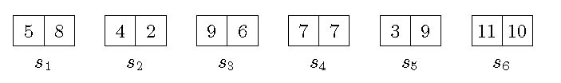

# lecture2_Exercise3

- 学号：2019Z8020661027；姓名：乔咏田

# 题目

- 现有n 块“多米诺骨牌” $s_1,s_2,…,s_n$ 水平放成一排，每块骨牌 $s_i$ 包含左右两个部分，每个部分赋予一个非负整数值，如下图所示为包含6 块骨牌的序列。骨牌可做180 度旋转，使得原来在左边的值变到右边，而原来在右边的值移到左边，假设不论 $s_i$ 如何旋转，L[i] 总是存储 $s_i$ 左边的值，R[i] 总是存储 $s_i$ 右边的值，W[i] 用于存储 $s_i$ 的状态：当L[i] $\le$ R[i] 时记为0，否则记为1，试采用分治法设计算法求 $\sum_{i=1}^{n-1}R[i]\cdot L[i+1]$ 的最大值，以及当取得最大值时每个骨牌的状态。下面是n = 6 时的一个例子：

  

# 答案

## 算法流程

1. 骨牌序列左右两端各自补充数值为0的骨牌，补充后最终得到的结果不变。
2. 取中间位置 $\left \lceil \frac{first+last}{2} \right \rceil$ 的一对骨牌，从它们中间分割。
3. 计算左侧的 $\sum_i R[i]\cdot L[i+1]$ 与右侧的 $\sum_i R[i]\cdot L[i+1]$ ，左右两侧相加得数值 $max_1$ 。
4. 切分位置的一对骨牌，左右两个值进行交换。
5. 再次计算左侧的 $\sum_i R[i]\cdot L[i+1]$ 与右侧的 $\sum_i R[i]\cdot L[i+1]$ ，左右两侧相加得数值 $max_2$ 。
6. 选取 $max_1$ 与 $max_2$ 的较大值作为返回值。
7. 递归进行2-6操作，递归终止条件为两个骨牌相邻，不可再进行切分，此时计算 $R[i]\cdot L[i+1]$ ,作为返回值。
8. 每次进行第6步比较时，记录当前位置是否交换，最终根据状态交换结果计算出每个位置的状态。

## 时间复杂度

1. 骨牌左右补充后，$W(n)=W(n+2)$
2. 递归部分，左右交换后计算了两次，为 $4\cdot W(\frac{n+2}{2})$
3. 非关键步骤复杂度为 $O(n+2)$
4. 算法复杂度为：

$$
W(n)=W(n+2)=4\cdot W(\frac{n+2}{2})+O(n+2)
$$

5. 根据主定理 $b=4,c=2,E=\log_{c}b=2$ ，取 $\epsilon =0.5$ ，则有 $f(n)=n+2\in O(n^{2-0.5})$ 
6. 因此， $T(n)\in \Theta (n^{E})$ ，即  $T(n)\in \Theta (n^{2})$

## 算法代码与样例结果

- 例子计算结果 227，状态为：`[0, 1, 0, 0, 0, 1]`

- 示例代码

~~~python
import math

def calculate_domino(l_list, r_list, first, last, w_reverse_flag):
    """计算多米诺之和.

    Args:
        l_list: 每个位置的左侧数列.
        r_list: 每个位置的右侧数列.
        first: 起始位置.
        last: 末尾位置.
        w_reverse_flag: 状态是否逆转列表

    Returns:
        多米诺计算之和.
    """
    if last - first < 2:  # 牌的个数需要大于1
        raise Exception('骨牌个数需要大于1')

    def get_domino_max(l_list, r_list, first, last):
        if last - first == 1:
            max_ = r_list[first] * l_list[last]
            print('first:{}/{}， last：{}/{}, max:{}'.format(first, r_list[first], last, l_list[last], max_))
        else:
            middle = math.ceil((first + last) / 2)  # 向上取整
            print('middle:{}'.format(middle))
            max_l1 = get_domino_max(l_list, r_list, first, middle)
            max_r1 = get_domino_max(l_list, r_list, middle, last)
            max1 = max_l1 + max_r1
            # 交换
            print('交换前：left:{}， right：{}'.format(l_list[middle], r_list[middle]))
            temp = l_list[middle]
            l_list[middle] = r_list[middle]
            r_list[middle] = temp
            print('交换后：left:{}， right：{}'.format(l_list[middle], r_list[middle]))
            max_l2 = get_domino_max(l_list, r_list, first, middle)
            max_r2 = get_domino_max(l_list, r_list, middle, last)
            max2 = max_l2 + max_r2
            if max1 <= max2:
                max_ = max2
                w_reverse_flag[middle - 1] = False
            else:
                max_ = max1
                w_reverse_flag[middle - 1] = True
        return max_
    return get_domino_max(l_list, r_list, first, last)

if __name__ == "__main__":
    s = [[5, 8], [4, 2], [9, 6], [7, 7], [3, 9], [11, 10]]
    n = len(s)
    print('左右两端各加入一个为0的骨牌')
    r_list = [0]
    l_list = [0]
    for l, r in s:
        l_list.append(l)
        r_list.append(r)
    l_list.append(0)
    r_list.append(0)
    w_list = [0 if s_item[0] <= s_item[1] else 1 for s_item in s]
    print('初始化阶段')
    print('r_list:{}'.format(r_list))
    print('l_list:{}'.format(l_list))
    print('w_list:{}'.format(w_list))
    first = 0
    last = n + 1
    w_reverse_flag = [False] * n
    domino_max = calculate_domino(l_list, r_list, first, last, w_reverse_flag)
    print('重新排列计算后')
    print('domino_max:{}'.format(domino_max))
    print('w_reverse_flag:{}'.format(w_reverse_flag))
    for i in range(n):
        reverse_flag = w_reverse_flag[i]
        w = w_list[i]
        if reverse_flag:
            if w == 1:
                w_list[i] = 0
            else:
                w_list[i] = 1
    print('w_list:{}'.format(w_list))
~~~

