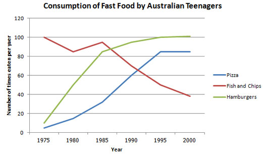

## 单词

- unit5

~~~
binary manipulate burgeoning simulate infinitesimal emergent analogy haunt consensus monopolise subtle discrete remnant nuanced resonance
~~~

- unit4

~~~
laureate consecutive underlying elicit faculty stun glide aesthetic compelling fallible seduce kitschy
~~~

- unit3

~~~
postulate proliferate conjecture verification mull cogent paradigm tribute admonish tutelage ingenious tacitly divine humdrum mundane contraption validate pluck veracity ascendancy proponent pantheon dearth verify curvature baton edifice confounding
~~~

- unit2

~~~
eruption testify churn hurl brooding indebted detonation consternation oust climactic colossal scour smithereens spiral confined clog enclose plunge unprecedented incessant implication whimsical flamboyant episode feasible intense staple exacerbate rampant ramification excavate scenario dissipate hazard trigger dormant innocuous
~~~

- unit1

~~~
axiomatic blurry forge crucible inform entangle disconcerting contour discern fickle erratic contemplative confines inscribe purport bystander dilute reconcile luminous crystallize vivify solitary introspection insomnia consummate embody
~~~

## 两人对话

~~~
A: Hello. Today let us talk something about the famous awards. Have you heard the report about this year's Nobel Prize?
B: Do you mean the award for the greatest benefits of mankind?
A: Yes, it is. How much do you know about it?
B: Emm… The Nobel Prize is a set of annual international awards bestowed in several categories by Swedish and Norwegian institutions in recognition of academic, cultural, or scientific advances. The will of the Swedish Nobel prizes in 1895. The prizes in Chemistry, Literature, Peace, Physics, and Physiology or Medicine were first awarded in 1901. The prizes are widely regarded as the most prestigious awards available in their respective fields.
A: We always hear foreigners appearing on the award list. Do you know who in our country has won the Nobel Prize?
B: Yeah.The first one is Liu Xiaobo.He is a Chinese writer who was awarded the 2010 Nobel Peace Prize for "his long and non-violent struggle for fundamental human rights in China." And the second is Mo Yan,a Chinese novelist and short story writer,who was awarded the Nobel Prize in Literature for his work as a writer "who with hallucinatory realism merges folk tales, history and the contemporary" in 2012.
A: Oh, I also remember a great Chinese woman.Her name is Tu Youyou,and she is the first Chinese Nobel laureate /ˈlɔːriət/ in physiology /ˌfɪziˈɑːlədʒi/ or medicine and the first female citizen of the People's Republic of China to receive a Nobel Prize in any category. Any one else？
B: Oh,the others are Chinese diaspora,like Yang Chen-Ning,Gao Xingjian and ...
A: Sorry to interrupt you. Yang Chen-Ning renounced his U.S. citizenship as of Sep 30, 2015 and reclaimed his Chinese citizenship. And he is also a Fellow of the Chinese Academy of Sciences. I believe that the Nobel Prize is the dream of many scientists, but if I'm not mistaken, it doesn't cover the field of computer science.
B: Exactly. You're right.You are a computer science student. Do you know any famous awards in computer science?
A: Of course, the Turing /'tjuəriŋ/ Award is every computer practitioner's dream.
B: Well, Turing sounds a bit like a name, like Nobel.
A: Yes.The award is named after Alan /'ælən/ Turing, a British mathematician /ˌmæθəməˈtɪʃn/ and lecturer in mathematics at the university of Manchester. The Turing prize is recognized as the highest honor in computer science and the "Nobel Prize for computing science".
B: Wow,sounds impressive,known as the "Nobel Prize in the field of computer". Then I think the Turing award should have a very high requirement,and the award process is very strict. Do you know who has won this award?
A: Typically, only one computer scientist is awarded each year. There are two people you may be familiar with. The first one is Hinton, the godfather of deep learning, who applied back-propagation algorithms /'ælgə'rɪðəmz/ to multi-layer /'mʌlti/ neural networks. Next up is Andrew Yao, a Chinese computer scientist and computational theorist who used the mini-max theorem /ˈθɪrəm/ to prove what is now known as Yao's principle.
B: Yeah, I know all of them. They are really great scholars and have made outstanding contributions in the fieds of technology. We must work hard to be as good as them.
~~~

## graph

​                                

​     Simple as it is, what the graph conveys to us is the change of consumption of fast food by Australian teenagers.From 1975 to 1995,the number of times about pizza and hamburgers eaten per year increases rapidly.Then it remains almost constant between 1995 and 2000. However the number of times about fish and chips has witnessed a dramatic decrease from 1985 to 2000,although it fluctuates slightly through the period between 1975 and 1985.

   What triggers this phenomenon?Studying it further,it is not difficult for us to come up with a considerable number of factors accounting for this trend.First of all, a lot of changes have taken place in the tastes of fast food among different generations.In addition, slightly healthier eating habit and convenience also affect this phenomenon.

   After what we have discussed above,we can easily come to the conclusion that this trend will continue for several years.However,some effective measures,for example exercise, should be taken for teenagers in order to keep healthy. 