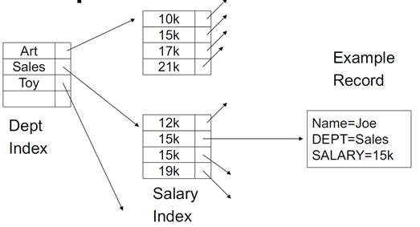

# 高级数据库系统

## 简介

- 参考书目《七周七数据库》

## 数据管理技术简介

- 并发：一个CPU（或一台主机），做多个任务，称为并发(concurrence)

- 并行：多个CPU（或主机）分担完成同一个应用，称为并行（parallel）；弄不好则忙闲不均，有累死的，有打酱油的

### 数据管理模型的变迁

 

### 阻抗失衡问题

- Impedance mismatch：关系模型和内存中的数据结构之间存在差异

- 关系元组（tuple）中的值不可含嵌套记录

- 内存中的数据结构可包含嵌套记录

- 将内存中的数据结构保存到磁盘前，需将其转成“关系”形式

### *数据库模型要点

**数据模型、数据操作、数据约束**

### NoSQL数据库

l 纵向扩展（scale up）：提高服务器性能

l 横向扩展（scale out）：采用集群

l 关系数据库并不是设计给集群用的

–依靠“共享磁盘子系统”该文件系统将数据写入磁盘中

–数据分片到独立的服务器，ACID特性无法保证

–按单台服务器计费，昂贵的license费用

#### NoSQL特征

–非关系型

–不提供ACID支持

–集群环境运行

#### 缺点

–数据模型和查询语言没有经过数学验证

–功能简单

–无统一查询模型

#### 选用nosql的原因

l 待处理数据量很大，或对数据访问的效率要求很高，必须将数据放到集群上

l 采用一种更为方便的数据交互方式来提高应用程序开发效率

### 数据模型

数据模型（meta model），表示数据库组织数据的方式。

**非聚合**（aggregate-ignorant）：关系数据模型、图

**聚合**：树形数据模型、键值、文档、列族；聚合模型适用于集群运行环境；面向聚合的数据库不支持跨越多个聚合的ACID事务，但每次能在一个聚合结构上执行原子操作。

### 物化视图&映射-化简

–RDBMS中，使用“**视图”**机制来展示数据，通过基表计算得出视图，将视图缓存在磁盘中，即“物化视图”

–聚合模型中，通过**“****映射-****化简（map-reduce****）”**来解决

#### 映射-化简

“映射函数”将从数据库中读取的记录打散为“键值对”

“化简函数”将多个具备相同关键字的“键值对”汇聚成一个

### *数据量与数据相关性的关系图

## CAP理论

### 简介

l C:Consistency一致性：任何一个读操作总是能够读取最新的数据副本

l A:Availability可用性：对集群中某一个节点的每一次操作总是能够在确定的时间返回

l P: Partitions Tolerance 分区容忍性：在出现网络分区的情况下，集群仍然可用。

l CAP理论断言任何基于网络的数据共享系统，最多只能满足数据一致性、可用性、分区容忍性三要素中的两个要素。

l 当系统遭遇分区状况时，通常会略微舍弃一致性，以获取某种程度可用性。

### 不同程度的一致性处理方式（客户端一致性）

 

l 强一致性（即时一致性）：假如A先写入一个值到存储系统，存储系统**保证**后续的A,B,C的读操作都返回**最新值**。

l 弱一致性

–假如A先写入了一个值到存储系统，存储系统**不能保证**后续A,B,C的读取操作能够读到最新值。

–这种情况下有一个“不一致性窗口”的概念，它特指从A写入值，到后续操作A,B,C读取到最新值这一段时间。

l 最终一致性：最终一致性是弱一致性的一种特例

–假如A首先write了一个值到存储系统，存储系统保证如果在A,B,C后续读取之前没有其他写操作更新同样的值的话，最终所有的读取操作都会读取到A写入的最新的值。

–这种情况下，如果没有失败发生的话，“不一致性窗口”的大小依赖以下的几个因素：

•交互延迟

•系统的负载

•复制架构中replica的个数（可以理解为master/slave模式中，slave的个数）

### 一致性冲突问题

–Pessimistic：悲观解决方案是给数据上锁，防止冲突发生。

–Optimistic：乐观方案是当冲突发生后，检测到它并想办法解除它。

### **服务器一致性NWR

概念（适用于P2P系统）

–N：副本节点的个数

–W：更新的时候需要确认已经被更新的节点个数

–R：读数据的时候读取数据的节点个数

•强一致性的读操作保证W+R>N

•强一致性的写操作保证W>N/2

•最终一致性W+R<=N，此时读取和写入操作是不重叠的。

### 一致性总结

l **强一致性：任何访问都是获取数据的最新值**

–ACID（原子性、一致性、隔离性、持久性）

–在单机环境中，强一致性可以由数据库的事务来保证。

–在多机环境中，强一致性很难做到。

--分布式事务：性能太差，在互联网的应用中不适合。

l **弱一致性（包括最终一致性）：数据更新和获取最新数据之间存在“****不一致窗口”**

–最终一致性使得数据的提交具有延时性，而在一定延时性范围内（比如一秒），应用的可用性是OK的。

CP：强一致性；

PA：弱一致性

### CAP与ACID

l 当系统没有Partition（分区）时：支持FullACID

l 当系统出现Partition时：

Atomic（原子性）:不同的分区还是应该保持Atomic

Consistent（一致性）:临时违背

Isolation（隔离性）:临时牺牲隔离性

Durable（持久性）:永远不该牺牲它（需要保留它用）

### **思考题

在P2P分布式系统中，考虑到容错性，一般N都大于3，此时根据CAP理论：

–如果配置为W=N，R=1，系统一致性如何？可用性如何？

A：一致性：系统为强制性的读与写操作；W+R>N,W>N/2；可用性：读操作总是能够在确定的时间返回。

–如果配置W=1，系统一致性如何？可用性如何？

A:一致性：系统为弱一致性；可用性：写操作总是能够在确定的时间返回。

–(N,R,W) 的值如果设置为(3, 2 ,2)，是出于什么考虑？

A:W+R=4>N；W>N/2；可保证强制一致性的读与写操作，系统读与写可用性较好。

## 索引技术

### 简介

### 常规索引

l 稠密索引：可以判断是否存在任何记录而不需要访问文件

l 稀疏索引：占用空间少，可以在内存中保留更多索引

l 稀疏更好地用于插入，密集需要用于二级索引

l 对于主索引，可以指向每个项的第一个实例（假设链接了块）；对于二级索引，需要指向记录列表，因为它们可以位于任何位置

l 优点：简单；索引是顺序文件（适合扫描）

l 缺点：插入代价高。

### B+树

l 规律：n + 1 pointers;n keys；

l 所有的叶子都在同一最低水平（平衡树）;叶子上的指针指向记录

### 哈希索引

l 与B树比较，优势：O（1）而不是O（log N）磁盘访问；劣势：无法有效地执行范围查询

### 多键索引

### K-D树

按任意顺序拆分维度以保存k维数据

## 关系型数据库

### *简介

最常见的经典的数据库模式。关系数据库管理系统（RDBMS），是基于集合理论的系统，实现方式是具有行和列的二维表。关系数据库严格强制使用类型，一般分为数值、字符串、日期和未解释的二进制大对象。

### **适合

如果提前知道数据的布局，但是可能不清楚随后你打算如何使用这些数据，那么关系型数据库是合适的。或者，换句话说，你提前为组织的复杂性付出代价，以实现随后的查询灵活性。

示例：许多业务问题正好是以这种方式建模的，从接单到出货以及库存到购物车。你可能**事先不知道以后将如何查询数据**（例如，我们在2月份处理了多少订单？），但**数据在本质上是相当规范的**，所以强制这种规范性是很有帮助的。

### **不那么适合

如果你的**数据是高度可变的或者多层次的**，那么关系数据库不是最合适。**因为你必须提前指定模式，所以，处理记录与记录之间有很大变化的数据问题将遇到麻烦**。假设考虑开发一个数据库来描述所有自然界中的生物。创建你需要考虑到的所有特征的完整列表（hasHair、numLegs、laysEggs等）会很棘手。在这种情况下，你选择的数据库最好对可能的输入有较少的预先限制。

### 数据模型

非聚合。

**RDBMS**

### NewSQL数据库

•ACID和SQL需要保留

•优化锁机制、日志机制和缓冲区管理

–取消缓冲池，在内存中运行整个数据库

–摈弃单线程的锁机制，冗余复制数据拷贝

•两类NewSQL产品

–拥有RDBMS服务，并将关系模型的优势带到分布式架构上

–提高RDBMS，使其不用考虑水平扩展即可满足需求

### ER图

l 弱实体：一个实体必须依赖另一个实体存在，那么前者是弱实体，后者是强实体。弱实体和强实体的联系必然只有1：N或者1：1，这是由于弱实体完全依赖于强实体，强实体不存在，那么弱实体就不存在，所以弱实体是完全参与联系的，因此弱实体与联系之间的联系也是用的**双线菱形**。

### **SQL

SQL，指结构化查询语言，全称是 Structured Query Language

#### 建表

#### 插入

#### 修改表结构

#### 删除

 

#### 更新

#### **查询join

## XML数据库

### 简介

### 数据模型

l 数据结构 ：树型结构，标记、元素、属性、……

l 数据操作 ：查询与转换（ XPath 、 XQuery 、 XSLT）

l 数据的约束条件 XML 文档模式（ DTD 、 XML Schema）（注意：模式限制了哪些数据可以存储进来）

### 优势

XML数据跨平台、面向对象。

### **XQuery查询技术FLWOR

l 它是一种专门用于XML半结构化数据的查询语言。

l FLWOR简介

FOR ... sequence expression 序列表达式；同 SQL 中的 from ，连接操作

LET... variable definition 变量表达式；设置，允许临时变量（SQL中无）

WHERE... Condition 条件；同 SQL 中 where 条件

RETURN... result expression 结果表达式；同 SQL 中的 select 投影

ORDERBY 排序；同 SQL 中 order by

l 在 for 子句中， variable_name 表示声明一个 范围变量（range variable ），然后为这个范围变量指定取值范围的集合，依次进行绑定。

l let 中的普通变量与 for 中的循环变量不同，它的取值仅进行 一次性地绑 定，而不是循环依次绑定。let $i as xs:integer := 100，“AS SQL” 用来定义数据类型；

l 可以使用 XPath 表达式中的判定谓词来取代 where 语句中的某些判断条件。当然，从可读性的角度来说，建议使用where 。

l 在 FLWOR 中， return 语句为候选结果集中的**每一个项计算一次**，这些计算结果连接形成 FLWOR 表达式的结果。

l return 语句返回结果的顺序由排序模式、或者 order by 语句决定。

l **可以输出任何文本信息**，包括 html 、 xml 、 xhtml 、纯文本等各种形式。

l XQuery 提供了一些构造方法，以便在查询中创建 XML 结构，即创建元素、属性、文档、文本、注释和处理指令节点。这些构造方法主要分为两大类： 直接构造方法 （类似于 XML 形式的表示方法）； 计算构造方法 （使用带括号的表示方法）。

l XML结构直接构造

l 元素计算构造：使用计算构造方法来构造元素，首先使用关键字 element”，然后以硬编码的方式指定该元素的名称 QName （限定的名称，可以包含命名空间前缀）、或者使用表达式 (“{” Expr “}”) 动态地计算出该元素的名称，最后使用内容表达式 “{”ContentExpr? “}” 计算出该元素的内容（如果没有表达式ContentExpr ，则该元素为空元素）。

l 属性计算构造：使用计算构造方法来构造属性，首先使用关键字 " attribute"，然后以硬编码的方式指定该属性的名称 QName （限定的名称可以包含命名空间前缀）、或者使用表达式 ("{" Expr "}") 动态地计算出该属性的名称，最后使用表达式 "{" Expr? "}" 计算出该属性的值（如果没有表达式 Expr ，则属性值为空）。

l 其他内容构造，注释节点、指令节点、文本节点

### **XPath

l 包含关系：祖先 后裔、双亲 孩子

l 位置关系 ：兄弟、之前/之后

l 它用来在 XML 文档中进行导航和查询的路径表达语言，可以对 XML 文档层次结构中的相关元素节点及内容进行检索、定位。

l 节点的类型：

–文档节点（ Document node ）、

–元素节点（ Element Nodes ）、

–属性节点（ Attribute Nodes ）、

–文本节点（ Text Nodes ）、

–命名空间节点（ Namespace Nodes ）、

–处理指令节点（ PI Nodes ）、

–注释节点（ Comment Nodes ）。

l ***\*****位置路径表达式\****

–相对位置路径表达式：由多个 Step 构成，比如Step1/Step2/Step3

–绝对位置路径表达式：以 / 开头，后面跟的是相对位置路径表达式，或者直接是简写的绝对位置路径表达式；

l Step 包括：

–轴（axis）：定义所选节点与当前节点之间的树关系

–节点测试（ node test）：识别某个轴内部的节点

–零个或者更多谓词（ predicate）：更深入地提炼所选的节点集

l 步的语法：轴名称::节点测试[谓词]

l 示例XML文档及关系轴

l XPath 表达式规范

–允许通配符、命名空间

–不允许 XPath 谓词 /a/b[c=5]

### 索引技术

#### 结构索引

**结构概要索引**

l 思想

–对 XML 树的结构进行约简，约简后的树中不存在路径相同的两个结点

l 特点

–结构概要保持了原始 XML 文档的结构信息，一般比原始 XML 文档的图结构要小得多

–减少对原始 XML

结点编码索引：位向量编码、前缀编码、区间编码。

#### 值索引

B+树

### 存储技术

边模型映射方法 XML 图（有序有向边标记图），用关系存储边信息和结点值。

结点模型映射方法 ：用关系存储结点信息、结点值和结构信息。

结构映射方法 ：从 DTD 或 Schema 推断 XML 元素应该如何映射到关系表。

约束映射方法 ：利用语义约束（键、函数依赖）来产生关系模式。

## 分布式数据库

### 原因

l 相同数据存储在不同节点来减少节点错误风险（相当于备份）。

l 跨节点划分数据项以提高扩展性能（分区）

l 不停机维护，弹性资源使用。

### 复制策略

主从、复制仲裁（NWR），保证读与写有重复、

### 分片策略

### 事务

## 键值数据库-NoSQL

### 简介

l 也称为分布式哈希表（DHT）

l 主要思想：在许多机器上划分键值集，按键分片后存放到不同节点。

l 键-值（KV）存储库是我们介绍过的最简单的模型。KV将简单的键映射到（可能）更复杂的值，就像一个巨大的哈希表。由于它们相对简单，因此这种类型的数据库实现起来最灵活。哈希查找速度快，在Redis的例子中就是这样，速度是其主要的关注。哈希查找也容易分布化，所以Riak利用这一事实，侧重于简单管理的集群。当然，它的简单性可能对有复杂的建模需求的数据是个缺点。

### **适合

由于很少或不需要维护索引，键-值存储库往往具有横向的可扩展性，速度极快，或两者兼而有之。它们特别适合于数据相关性不高的问题。例如，在Web应用中，用户的会话数据满足这个标准，每个用户的会话活动会有所不同，并且大部分是与其他用户的活动无关的。

### **不那么适合

往往缺乏索引和扫描功能，如果你需要能够执行数据查询，除了基本的CRUD操作（创建、读取、更新、删除）以外，KV存储库的帮助不大。

### 数据模型

l **聚合不透明：**只能通过键来查找整个聚合信息

l **无内容限制：**聚合中可以存储任意数据

#### 数据结构

#### 数据操作

#### 约束条件

### Memcached

l 临时性键值存储，简单而有力

l 在互联网网站中被大量使用，作为应用和数据库之间的**缓存层**

#### 特点

l **全内存**运转

l 哈希方式存储

l 简单文本协议 telnet 进行数据通信

l 只操作 **字符型** 数据

l 其它类型数据由应用解释，序列化以及反序列化

l 集群 也由应用进行控制，采用一致性散列（哈希）算法

#### 缺点

l 纯内存操作，关机后数据全部丢失

l 保存字节数据，数据类型贫乏

l 一致性处理简单

l 应用端任务重，服务器端功能太简单

l 应用场景有限，难以被看成是完整的数据库产品

### Redis

#### 特点

l 键值存储

l 支持**丰富的数据类型**，如字符串，链表，集合等

l 内存 磁盘的持久化保存，内存占用高。

l 数据快照

l **自带的主从复制**

l 非常适合需要表达时间线的 web 服务，例如微博

l redis作为辅助存储被用作缓存，加快访问读取的速度，提高性能

#### **思考题

如果使用 redis 做购物车分析，通过分析大量购物车中的商品，计算出购买某商品的顾客的购物车还有什么高频出现的商品，从而改善货架和推荐系统。

要求：

1、给出数据模型设计？

A：使用有序集合(sorted set)作为数据模型，KEY_NAME为某个商品a的名称，VALUE为与a同时出现在某个购物车的商品b的名称，SCORE为商品b的频率统计。

2、redis是否适合解决此类问题？

A：有序集合能很好地进行数据统计，可以通过score的排序获得购买某商品a的顾客的购物车还有什么高频出现的商品b。

#### Redis的优点

像许多同类的键值对存储库一样，Redis的明显优势是速度快。但与大多数键-值对存储库不同的是，Redis提供存储复杂值的能力，如列表、哈希表和集合，并基于这些数据类型上的特定操作来获取数据。但是，Redis不只是数据结构存储库，它的持久性选项允许你为了数据安全性而牺牲速度，这到了相当细致的程度。内置的主从复制机制提供了另一种很好的方式，来确保更好的持久性，而无须放慢速度，在每次操作时同步磁盘上的仅追加文件。此外，复制机制对于大量读取的系统是很好的。

#### Redis的缺点

Redis很快，在很大程度上是因为它驻留在内存中。有些人可能会认为这是作弊，因为从来不接触磁盘的数据库肯定很快。内存数据库有一个固有的持久性问题，如果你在快照发生之前关闭数据库，你可能会丢失数据。即使你设置在每个操作时都同步磁盘上的仅追加文件，你也冒着回放过期值的风险，因为基于时间的事件永远不会以完全同样的方式重放——虽然公平地说，这种情况是假设于实际。

Redis也不会支持比你的可用内存更大的数据集（Redis将不支持虚拟内存），所以它的大小有实际限制。目前虽然正在开发一个Redis集群，目标是超过单机的RAM限制，但现在想用Redis集群的人必须自己处理，使用支持它的客户端（像我们在第2天使用过的Ruby驱动程序）。

### Riak

l 键 ：类似关系数据库的“主键”。

l 值 ：数据库存储的一块数据，可以是任何类型的数据（文本、 JSON 、 XML 、图片、视频等），通过普通的 HTTP 接口访问，应用程序负责解析所存的数据。

l 特点 ：总是通过主键访问，一般性能较高，易于扩展。

#### 存储结构

为避免冲突， Riak 将键分为若干种类，放到不同桶中。

Riak 将任何数据都另存为 二进制编码。

#### 冲突解决

以向量时钟解决冲突。

向量时钟记录：哪个客户端、以哪种顺序更新了数据

#### Riak的优点

如果你想设计一个类似Amazon的大型订货系统，或者你最关注的是高可用性，这时，你应该考虑一下Riak。无疑，Riak的优势之一就是它致力于避免单点故障，设法支持最大的正常运行时间，并且增加（或者缩小）规模以适应变化的需求。如果你没有复杂的数据，Riak让一切维持简单的状态，然而一旦你需要，它也可以处理相当复杂的数据。目前，Riak支持许多编程语言（你能在Riak网站上找到相关内容），但是如果你使用Erlang，就能获得扩展Riak核心的能力。你若需要超出HTTP处理能力的速度，也可以试试通过Protobuf17进行通信，它是一种更有效率的二进制编码和传输协议。

#### Riak的缺点

如果你需要简单的查询能力、复杂的数据结构或者严格的模式，又或者你不需要节点服务器进行横向扩展，那么Riak可能不是你的最佳选择。我们对于Riak的主要抱怨之一是，作为自由定义（ad hoc）的查询框架，它依然不够简单而健壮，尽管Riak确实在正确的轨道上前进。mapreduce提供了无与伦比的强大功能，但是我们希望有更多内置的基于URL或者其他PUT查询的操作。索引的加入是在这个方向上的一大进步，也是我们乐意详述的一个概念。最后，如果你不想编写Erlang代码，你会发现使用JavaScript的一些限制，比如，不能实现提交后处理，或者，较慢的mapreduce执行过程。但是，Riak团队正在解决这些相对较小的问题。

或者严格的模式，又或者你不需要节点服务器进行横向扩展，那么Riak可能不是你的最佳选择。我们对于Riak的主要抱怨之一是，作为自由定义（ad hoc）的查询框架，它依然不够简单而健壮，尽管Riak确实在正确的轨道上前进。mapreduce提供了无与伦比的强大功能，但是我们希望有更多内置的基于URL或者其他PUT查询的操作。索引的加入是在这个方向上的一大进步，也是我们乐意详述的一个概念。最后，如果你不想编写Erlang代码，你会发现使用JavaScript的一些限制，比如，不能实现提交后处理，或者，较慢的mapreduce执行过程。但是，Riak团队正在解决这些相对较小的问题。

#### Riak之于CAP

Riak提供了一个聪明的方法，以规避CAP施加于所有分布式数据库上的约束。相比像PostgreSQL这样只支持强写入一致性的系统，Riak对于这个问题的处理能力是惊人的。它利用了Amazon Dynamo论文的深刻观点——CAP可以在每个桶或者每个请求的基础上改变。它的健壮与灵活是开源数据库系统发展的一大进步。当你读到本书中的其他数据库时，想起Riak，你依然会惊叹于它的灵活性。

## 文档数据库-NoSQL

### 简介

文档型数据库允许每个对象有任意数量的字段，甚至允许对象作为值以任意深度嵌套到其他字段中。这些对象通常用JavaScript对象符号（JSON）表示，MongoDB和CouchDB都是这样，但这绝不是一个概念要求。由于文档型数据库不像关系数据库那样彼此相关，它们比较容易在几个服务器上实现分片和复制，这使得分布式实现相当普遍。MongoHQ倾向于支持建立数据中心，管理Web上庞大的数据集，从而解决可用性问题。而CouchDB则侧重于简单耐用，可用性是通过相当自治的节点的主-主复制得到的。这些项目之间有很高的重叠性。

### **适合

文档数据库适合于涉及高度可变领域的问题。当你事先不知道你的数据看起来究竟像什么样子，文档型数据库是一个不错的选择。此外，由于文档型数据库的性质，它们往往能很好地映射到面向对象编程模型。这意味着在数据库模型和应用模型之间移动数据时，阻抗性不匹配的情况较少。

### **不那么适合

如果你习惯于在高度规范化的关系数据库模式中执行复杂的联接查询，你会发现文档型数据库的功能匮乏。文档型数据库一般应包含大部分或全部正常使用所需的有关信息。因此，在一个关系数据库中，你最好自然地规范化你的数据，以减少或消除可能不同步的副本，而使用文档型数据库，非规范化的数据是常态。

### 数据模型

l **聚合透明**：可看到聚合的结构

l **限制内容**：定义了允许的结构与数据类型

l **关键字查找**：可按照聚合中的字段创建索引或查询

#### 数据结构

l 文档数据库 **模式自由**（ schemaless）

l 通过两种方式描述：引用式和嵌入式

l JSON格式的文档，花括号表示一个对象，方括号表示一个数组。

#### 数据操作

#### 约束条件

### 技术优势

l 面向文档的存储引擎，方便支持**非结构化**数据

l 全面的索引支持，可以在**任意属性上建立索引**

l 数据库本身内置的**复制**与高可用

l 数据库本身支持的**自动分片**集群

l 丰富的基于文档的查询功能

l 原子化的数据操作

l 支持 Map/Reduce

### 分片副本集

l 一个分片包含数据的某一子集。若某一分片包含多台服务器，则每台服务器拥有一份完整的数据副本。

l **一分片一区间**：导致级联效应，把数据移动到下一台服务器上，即不能改善平衡性。

l **一分片多区间**：MongoDB 的数据分配方法，当一个块越来越大时， MongoDB 会自动将其分割成两个小块。如果分片间比例失调，则会迁移块来确保均衡。

### 片键

片键决定了数据在集群中的分布情况

**•反面片键**

–小基数片键：片键值数量有限

–升序片键：数据总是添加到最后一个数据块上

–随机片键：增加内存压力，浪费一个索引

**•好片键**

–准升序键 搜索键｛coarseLocality : 1, **search** :1｝

–如：｛ month:1, user:1 ｝作为片键

### **片键思考题

Search字段可不可以也是升序字段？

A：如果search字段是升序字段，那么该好片键也会变成单纯的升序片键，search失去了搜索键的功效，它们转变为了反面片键。

Search字段应有什么特点？

A：对升序做平衡的字段。

### MongoDB

#### 简介

l MongoDB 是一种**面向集合**（collection）的**模式自由**的文档（ document ）数据库。

l 除了模式不是预先定义好的， **集合**与RDBMS中的**表**概念类似。

l **数据库和集合**的创建是“**lazy**”的：只有在第一个 document 被插入时，集合和数据库才真正创建-这时在磁盘的文件系统里才能看见。

#### 索引类型

B-Tree

#### Mongo的优点

Mongo的主要优势在于，它能够通过复制和横向伸缩，处理大量的数据（以及大量的请求）。但它还有另一项好处，即非常灵活的数据模型，因为不需要遵从某个模式，可以简单地嵌套任何值，而这在RDBMS中通常需要使用SQL进行联接。

最后，MongoDB的设计目标是易于使用。你可能注意到Mongo的命令和SQL的数据库概念之间的相似性（除了服务器端的联接之外）。这并非偶然，Mongo受到这么多前对象关系模型（Object Relational Model，ORM）用户青睐，这也是原因之一。它的不同足以挠到许多开发者的痒处，但又没有完全不同，成为令人恐怖的怪物。

#### Mongo的缺点

Mongo鼓励反规范化的模式（没有任何模式），这对于一些人可能难以接受。一些开发者发现，关系数据库无情的、严格的约束让人感到放心。将任意类型的任意值插入任意集合，这可能很危险。如果你没想到检查字段名和集合名是否有问题，一个录入错误可能导致几个小时的头痛。如果数据模型已经相当成熟，不会变化，那么Mongo的灵活性通常并不重要。

因为Mongo关注大型数据集，所以它很适合大型集群，这可能需要花一些努力去设计和管理。在Riak中，添加新的节点是透明的、几乎没有痛苦操作。Mongo不一样，建立Mongo集群需要一些前期思考。

## 列族数据库-NoSQL

### 简介

列型数据库（又称面向列的数据库，或列系列）与KV和RDBMS存储有许多的相似之处。像键-值存储库一样，值的查询通过匹配键完成。类似于关系数据库，把它们的值分组为零或多列，但是每一行可以填充任意多的数据。不同于前两个数据库，列型数据库按列存储类似的数据，而不是按行存储数据。列的添加很容易，版本控制是小菜一碟，并且对于空值没有存储成本。我们看到了HBase是对这一类型的经典实现。

### **适合

传统上，**横向扩展**作为列型数据库开发的一个主要的设计目标。正因为如此，它们特别适合于在几十、几百或几千个节点的集群上的“大数据”问题。它们也往往内置支持如压缩和版本控制的功能。一个良好的列型数据存储问题的典型例子是索引网页。网页上有大量的文本（好处来自于压缩），在某种程度上相互关联，并随着时间变化（好处来自于版本控制）。

### **不那么适合

不同的列型数据库有不同的特点，并由此带来不同缺点。但有一件事它们是相同的，那就是，最好基于你打算如何查询数据，设计你的数据库模式。这意味着，你应该预先对如何使用数据而不仅仅是数据将如何组成有一些想法。所以，如果你不能提前定义数据的使用模式（例如，需要快速的自由定义的报表），那么列型数据库未必是最合适的。

### Cassandra

#### 简介

l 支持无中心的分布式设计，不存在单点问题，所有节点功能完全一样

l 纯粹的水平扩展： 不必重启任何进程， 在不间断服务的情况下可弹性扩展或收缩规模

l 较强容灾能力： 高可用，支持热替换故障节点，支持多数据中心

l 可调节的一致性

#### 数据模型

l 表是行的有序集合的容器，每个行本身都是列的有序集合

Static column：每一行不能重复，普通column可以重复

l 围绕着查询模式进行Table建模，从设计实体及其关系开始

l 为提升**读性能**进行反范式化和冗余

l 有多种方式创建模型，最佳的方式**依赖于你的用例和查询模式**。

l 选择合适的 rowkey ，避免热点；糟糕的row key: ddmmyyhh；不错的row key: ddmmyyhh|eventtype

#### 与关系型数据库的设计差别

l 很弱的查询语言 create drop get set del

l 不支持连接

l 没有外键的概念

l 反范式化设计

### 集群机制

一致性哈希、Gossip 协议、Snitch、复制策略

#### 一致性哈希Consistent Hash

l 我们把每台server分成v个虚拟节点，再把所有虚拟节点(n*v)随机分配到一致性哈希的圆环上，这样所有的用户从自己圆环上的位置顺时针往下取到第一个vnode就是自己所属节点。当此节点存在故障时，再顺时针取下一个作为替代节点。

l 添加新节点，小部分数据发生迁移

l **优点：**发生单点故障时负载会均衡分散到其他所有节点，程序实现也比较优雅。

### 副本放置策略

简单策略、旧网络拓扑策略、网络拓扑策略、副本因子

### 数据模型

 

l 各行不一定要具备完全相同的列

l 可以随意向其中某行加入一列，而不用把它添加到其它行中

#### 数据结构

#### 数据操作

#### 约束条件

 

## 图数据库-NoSQL

### 简介

•也可称为面向/基于图的数据库（Graph database）

•以“图”这种数据结构存储和查询数据

•基本存储单元为：节点node、关系relationship、属性property

•图模型种类：

–Property graph：一条边只有一个起点和一个终点，是最常用的图模型

–hypergraphstores：一条边可有多个起点和多个终点

–Hypernodes：结点可以嵌套

–Triple stores：语义网中RDF数据的模型

l 图数据库是一个新兴的数据库类型，更侧重于自由解释数据之间的相互关系而不是实际的数据值。作为我们的开源示例，Neo4j在许多社交网络应用中日益普及。不像其他数据库类型将相似的对象划为共同的组，图数据库在形式上更自由——查询包含两个节点共享的边，即在节点之间移动。随着越来越多的项目使用它们，图数据库在简单的社交例子上不断发展，用于更多差异细微的使用场景，例如，推荐引擎、访问控制列表和地理数据。

### **适合

图数据库似乎是为网络应用量身定做的。典型的例子是社交网络，其中节点代表相互之间有各种关系的用户。使用任何其他的类型对这种数据建模，往往难以适应，但图数据库会欣然接受。它们还是面向对象系统的完美匹配。如果可以在白板上建模数据，就可以在图中建模。

### **不那么适合

由于节点之间的高度相互关联，因此图数据库一般不适合网络分区。因为图的快速爬取意味着你不能与其他数据库节点的网络联接，所以图数据库不能很好地向外扩展。可能的情况是，如果你使用图数据库，它会是一个较大系统的一部分，大容量数据存储在其他地方，而在图中只保存关系。

### 数据模型

 

l 聚合数据模型难以处理位于不同聚合的实体之间的关系

l 图模型重视关系

l 通常在单一的服务器上

l 易于设计和模型直接表示的模型

#### 数据结构

l 简单图（节点+边+标签+方向）

l 推广：嵌套图（超节点）、超图（超边）、属性图

l 图数据模型的属性：

Nodes：Entities

Relationships：连接实体和结构域

Properties：属性和元数据

Labels：按角色分组节点

#### 数据操作

- 简单函数（如最短路径）

- 图形查询语言（运算符）

- 领域特定查询：图形模式挖掘

#### 约束条件

- 架构实例（Schema-instance）一致性

- 节点、属性和关系的识别

- 路径约束

### 与关系型数据库比较

关系型数据库数据模型为集合互联接表；图数据库数据模型为多关系图。

### Neo4j

#### 简介

- Neo4J图数据库无模型（schemaless）

- Neo4J图数据库三要素：节点（node）、关系（relationship）、属性（property）

- Neo4J图数据库两大利器：遍历工具（traversal）、索引器（indexer）

#### 查询语言

